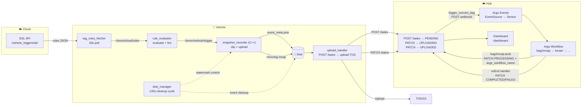
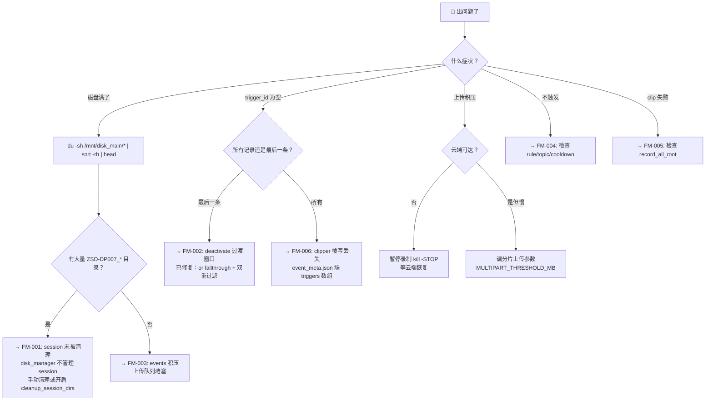

# Data Loop — 数据闭环管道

## 一句话
掌握 snapshot_recorder 全链路（DSL 规则→触发→剪辑→上传→云端），快速排障。

## When to Use
- 调试：磁盘满、trigger_id 为空、上传积压、clip 失败
- 开发：修改 `snapshot_recorder/` 下任一组件的代码
- 审查：数据闭环 PR review
- 运维：日常巡检、应急响应

## 变更流程

> 大改先提案，小修直接干。改数据闭环代码前按此流程走。

| 步骤 | 做什么 | 产物 |
|------|--------|------|
| 1. **explore** | 读 SKILL.md + 相关代码 + 现有 FM，理解现状 | 方案思路 |
| 2. **propose** | 写清楚：改什么文件、为什么改、如何回滚 | 更新设计原则/关键文件 |
| 3. **apply** | 实现 + 验证：`ros2 topic echo` 确认管道正常 | 代码变更 |
| 4. **archive** | 沉淀：新故障模式 → FM；新约束 → loop-constraints | 更新 references/ |

**小修免提案**（typo、日志格式、配置调优）。**大改必提案**（新增组件、改 trigger_id 流转、改清理策略）。

## 管道全景



## 回调机制

> ⚠️ **只有 zeron-upload-hub 触发的 dataloop pipeline 才有回调**。guangqing 等离线 pipeline 不走 upload-hub，`UPLOAD_HUB_URL` 未设，`_callback_hub` 自动跳过。

### 双回调冗余设计（Argo onExit）

```
bag2mcap-post (Python, 3次重试)          onExit handler (Argo 原生, 永远执行)
├─ PROCESSING + 前置步骤 COMPLETED        ├─ Succeeded → 全量步骤 COMPLETED
│                                         ├─ Failed → FAILED (保留前置步骤状态)
│                                         │  ({{workflow.status}} 在 onExit 上下文有效)
▼                                         ▼
              upload-hub 盲写 upsert
         (任意一个回调成功 = 状态完整)
```

### 可靠性矩阵

| 场景 | bag2mcap-post | exit-handler | Hub 最终状态 |
|------|:---:|:---:|------|
| 全部成功 | ✅ | ✅ | PROCESSING→COMPLETED, 全步骤 COMPLETED |
| 某步失败 | ✅ | ✅ | PROCESSING→FAILED, 前置步骤保留 |
| bag2mcap-post 丢 | ❌ | ✅ | COMPLETED/FAILED (NOT_STARTED→终态) |
| exit-handler 丢 | ✅ | ❌ | PROCESSING (悬挂→重试) |
| 两个回调都丢 | ❌ | ❌ | UPLOADED 无进展 → Dashboard 触发 DAG 重试 |

### 幂等性保证

| 操作 | 机制 |
|------|------|
| DAG 触发 | `dag_triggered_at` 去重 + strip `_\d+` 后缀 |
| 步骤写入 | `upsert_step_by_name` 盲写，重复调用安全 |
| FAILED 重试 | Argo 原生 retry（只重跑失败节点，bag2mcap 不重跑）+ fallback 到新 Workflow |
| 回调重试 | `_callback_hub` 3次指数退避 (1s/2s/4s) |

## 排障决策树

> **万能第一步**: `ros2 topic echo /rosout | grep -E "\[TRIGGER\]|\[UPLOAD\]|\[DiskManager\]|\[CLIP\]|\[RULE\]" | tail -20`



## 关键文件

| 文件 | 角色 | 易错点 |
|------|------|--------|
| `tag_rules_fetcher_node.py` | DSL API → ROS2 rules | `dict.get(k, d)` vs `dict.get(k) or d` |
| `rules_merger_node.py` | 合并 HTTP + Push 规则 | push 覆盖 http 同 id |
| `rule_evaluator_node.py` | 评估条件→发布 trigger | `_on_rules` 替换不影响进行中的 `_tick` 迭代 |
| `snapshot_recorder_node.cpp` | 接收 trigger→clip→upload | `rec_state_` 原子门，一次只处理一个 |
| `event_directory_manager.cpp` | 创建 event dir + metadata | 新格式 writes `triggers[]` 而非顶层 `id` |
| `record_all_clipper.py` | 从 session 剪辑 mcap | `meta.update()` 不覆盖 `triggers` |
| `upload_handler.py` | 注册任务→上传→PATCH | 从磁盘读，不依赖 DSL API |
| `api_client.py` | 云端 API 客户端 | token 过期、重试、热重载 |
| `disk_manager.py` | 磁盘清理+录制控制 | 只管理 `events/`，不管理 session（默认） |
| `config_loader.py` | 统一配置加载 | YAML + `SNAP_` env 覆盖 + 磁盘自适应 |
| `dag_trigger.py` | Argo Events webhook 触发 | 只发 dataloop，带 3 次退避重试 |
| `routes/tasks.py` | 上传生命周期 API | vname 提取 + dag_triggered_at 去重 |
| `routes/pages.py` | Dashboard | 任务列表 / 重试 / Argo 直达 |
| `argo_client.py` | Argo API（已废弃） | dataloop 改用 Argo Events webhook |
| `orchestrator/pipelines/bag_convert.py` | 云端 pipeline 编排 | `_callback_hub` 受 `UPLOAD_HUB_URL` 控制 |

## 生产扩展性设计

### 多 pipeline 支持（配置驱动）

| 等级 | 方式 | 改动 |
|------|------|------|
| **新增 pipeline** | 设 `PIPELINES_JSON` env var | 零代码，只需加 EventSource endpoint + Sensor + WF |
| **新增步骤** | 设 `PIPELINE_STEPS_JSON` env var | 零代码，JSON 数组追加 |
| **新增状态** | 改 `VALID_*_STATUSES` + `*_TRANSITIONS` | 常量级，models.py |
| **新增回调** | 加 workflow 步骤 + curl PATCH | 纯 YAML，无需改 upload-hub |

```bash
# 加新 pipeline 只需环境变量：
PIPELINES_JSON='{"dataloop":"dataloop-bag-convert","new-type":"new-type-endpoint"}'
PIPELINE_STEPS_JSON='[{"name":"step1","order":1,"parent":""},{"name":"step2","order":2,"parent":"step1"}]'
```

### 告警信号（Prometheus 就绪）

```
# 触发失败（从未触发）
task{status="UPLOADED",dag_triggered_at=""}  # Dashboard → "触发 DAG"

# 工作流失败（可重试）
task{process_status="FAILED"}  # Dashboard → "重试"，Argo 原生 retry（只重跑失败节点）

# 处理悬挂
task{process_status="PROCESSING"} AND process_started_at < now() - 6h
```

| 决策 | 说明 |
|------|------|
| **dataloop 用 Argo Events，不用 Argo API** | Sensor 模式解耦，EventSource webhook 触发 |
| **最终回调用 onExit handler，不用 DAG 任务** | Argo 原生保证永远执行，无需复杂 depends 表达式 |
| **retry 用 Argo 原生 retry API** | 只重跑失败节点，bag2mcap 不重跑已转换文件 |
| **bag2mcap 成功不重跑** | 文件处理不可逆，retryStrategy 只在失败时生效 |
| **回调仅 dataloop 有** | `UPLOAD_HUB_URL` 环境变量控制，guangqing 不设 → 自动跳过 |
| **vname 从 task_id 提取** | `ZSD-DP007_2026-07-05-01-49-30` → regex → `ZSD-DP007` |
| **多 trigger 去重** | `dag_triggered_at` DB 字段 + strip `_\d+` 后缀 |

## 核心设计原则

1. **磁盘链路解耦**：trigger 发布后走 `event_meta.json` 磁盘链路，不依赖 DSL API 后续返回
2. **防御性 ID**：`tag_rules_fetcher`（`or` fallthrough）+ `rule_evaluator`（skip empty id）双重过滤
3. **默认安全**：session 目录不自动删（拔盘离线上传），上传队列超阈值自动节流
4. **渐进降级**：磁盘满→暂停录制→节流触发→丢弃低优先级→紧急清理
5. **可观测性**：`[DiskManager]` `[TRIGGER]` `[UPLOAD]` `[CLIP]` `[RULE]` 日志前缀 + Prometheus 指标

## 配置速查

> 完整配置在 `config/snapshot_recorder.yaml`。紧急覆盖用 `SNAP_` 环境变量。

| 配置项 | 默认 | 说明 |
|--------|------|------|
| `disk.high_watermark_pct` | 80 | 暂停录制水位 |
| `disk.low_watermark_pct` | 60 | 恢复录制水位 |
| `disk.cleanup_session_dirs` | **false** | 自动删 session？默认关 |
| `queue.max_upload_queue` | 10 | >此值节流触发 |
| `queue.critical_upload_queue` | 20 | >此值丢弃低优先级 |
| `clip.rule_cooldown_s` | 10.0 | 同 rule 去重间隔 |

## 常用命令

```bash
# 管道状态一键检查
echo "Disk: $(df -h /mnt/disk_main | awk 'NR==2{print $5}')" && \
echo "Queue: $(ls /mnt/disk_main/events/.upload_queue/job_*.json 2>/dev/null | wc -l) jobs" && \
echo "Events: $(ls -d /mnt/disk_main/events/event_* 2>/dev/null | wc -l) dirs" && \
echo "Rules: $(ros2 topic echo /zeron/cloud/rules --once 2>/dev/null | python3 -c "import sys,json;print(len(json.load(sys.stdin)['rules']))") active"

# 查看日志
ros2 topic echo /rosout | grep -E "\[TRIGGER\]|\[UPLOAD\]|\[DiskManager\]|\[CLIP\]"

# 云端运维
kubectl --kubeconfig ~/kube.conf -n data-pipeline logs -l app=zeron-upload-hub --tail 50
kubectl --kubeconfig ~/kube.conf -n data-pipeline exec deploy/zeron-upload-hub -- python3 -c "import urllib.request; print(urllib.request.urlopen('http://localhost:5002/health').read())"
kubectl --kubeconfig ~/kube.conf -n smartdrive get workflows | grep dataloop
argo logs -n smartdrive @latest                                  # WF 日志

# 手动触发 DAG（Dashboard 按钮等价操作）
curl -X POST http://upload-hub/api/v1/tasks/{task_id}/retry

# zeron-upload-hub 部署
cd zeron-upload-hub && bash scripts/deploy.sh 0.0.8             # build + push + ArgoCD
cd zeron-upload-hub && bash scripts/deploy.sh 0.0.8 --sync      # 加手动触发 sync

# orchestrator 部署
cd data-preprocess-k8s/orchestrator && bash build.sh             # build + push 0.0.3
# 然后更新 WF image tag 并 kubectl apply

# 紧急降低水位
export SNAP_DISK_HIGH_WATERMARK_PCT=70
pkill -f disk_manager.py && python3 /path/to/disk_manager.py &

# 启动 recorder
ros2 launch snapshot_recorder recorder.launch.py --ros-args -p session_parent_dir:=/mnt/disk_main
```

## 部署流程

### 涉及组件

| 组件 | 路径 | 部署方式 |
|------|------|---------|
| orchestrator 镜像 | `data-preprocess-k8s/orchestrator/` | `build.sh` → Harbor, 手动更新 WF image tag |
| Argo WorkflowTemplate | `data-preprocess-k8s/argo-data-preprocess/dataloop_bag_convert/` | `kubectl apply` |
| ResourceQuota | `data-preprocess-k8s/argo-config/resourcequota-dataloop.yaml` | `kubectl apply` |
| zeron-upload-hub | `zeron-upload-hub/` | `scripts/deploy.sh <tag>` → ArgoCD 自动同步 |

### 部署顺序

```
orchestrator 镜像 ──→ Argo WorkflowTemplate + ResourceQuota ──→ upload-hub
     (先)                         (中)                              (后)
```

> **依赖**：WorkflowTemplate 引用 orchestrator 镜像 tag，必须先 push 镜像再 apply。upload-hub 无强依赖。

### 1. 构建 & 推送 Orchestrator 镜像

```bash
cd data-preprocess-k8s/orchestrator
grep '^VERSION=' build.sh         # 确认版本号
bash build.sh                      # 构建并推送（自动 --platform linux/amd64）
```

> build 完成后会打印 sed 命令，用于批量更新 WorkflowTemplate 中的 image tag。
> 示例: `sed -i 's|data-preprocess-orchestrator:[0-9.]*|data-preprocess-orchestrator:0.0.7|g'`

### 2. 应用 Argo 配置

```bash
# 确认 image tag 已更新
grep 'orchestrator:' data-preprocess-k8s/argo-data-preprocess/dataloop_bag_convert/workflowtemplate.yaml

kubectl apply -f data-preprocess-k8s/argo-data-preprocess/dataloop_bag_convert/workflowtemplate.yaml -n smartdrive
kubectl apply -f data-preprocess-k8s/argo-config/resourcequota-dataloop.yaml -n smartdrive

# 验证
kubectl get workflowtemplate dataloop-bag-convert -n smartdrive
```

### 3. 部署 zeron-upload-hub

```bash
cd zeron-upload-hub
bash scripts/deploy.sh 0.0.8      # build + push + bump kustomization.yaml + git push → ArgoCD 自动同步
# 或带手动触发 ArgoCD sync:
bash scripts/deploy.sh 0.0.8 --sync
```

### 部署验证

```bash
# 1. Pod 状态
kubectl --kubeconfig ~/kube.conf -n data-pipeline get pods -l app=zeron-upload-hub

# 2. Hub 健康检查（pod 内）
kubectl --kubeconfig ~/kube.conf -n data-pipeline exec deploy/zeron-upload-hub -- \
  python3 -c "import urllib.request; print(urllib.request.urlopen('http://localhost:5002/health').read())"

# 3. Argo WorkflowTemplate 已更新
kubectl get workflowtemplate dataloop-bag-convert -n smartdrive -o jsonpath='{.spec.templates[*].container.image}'

# 4. 端到端测试：手动触发一条任务
curl -X POST http://upload-hub/api/v1/tasks/{task_id}/retry
```

## 参考文档

- [LOOP.md](LOOP.md) — 4 个并发 loop 的运行态 + 碰撞检测 + Intent Debt Map
- [failure-modes.md](references/failure-modes.md) — 6 个已知故障模式 + 一键检测 + 修复方案
- [ops-runbook.md](references/ops-runbook.md) — 日常巡检 + 应急响应 + 配置调优 + Run Log & Budget
- [pipeline-architecture.md](references/pipeline-architecture.md) — 系统边界 + LOOP 反模式对照 + 升级路径
- [loop-constraints.md](references/loop-constraints.md) — 机器可读约束（Pre-Flight + 重试上限 + 磁盘预算 + denylist + 紧急覆盖）
- [bag2mcap-pipeline-analysis.md](references/bag2mcap-pipeline-analysis.md) — bag2mcap 全链路分析 + Argo Events 架构 + TOS 路径映射 + 重试策略
