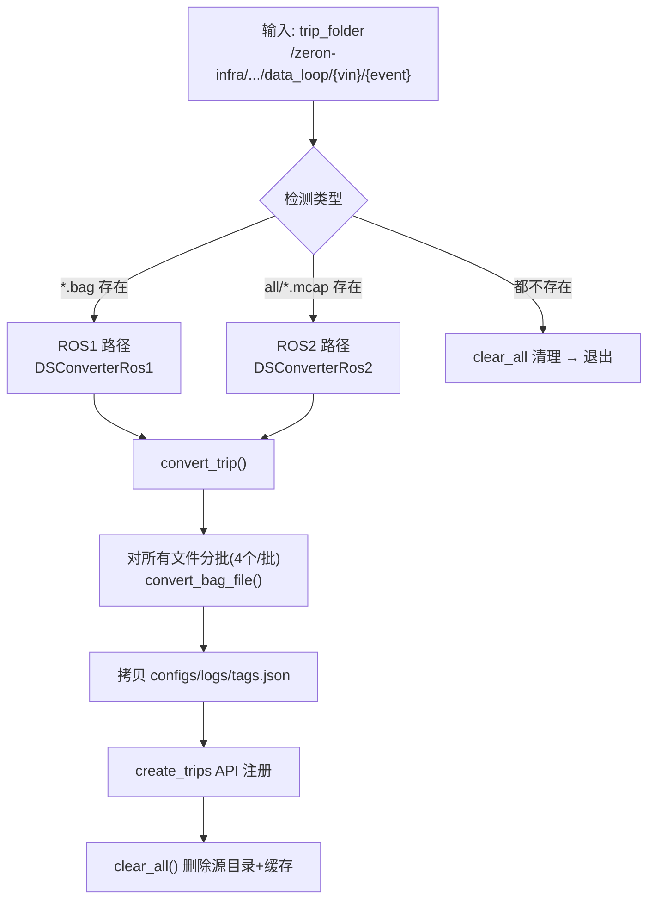

# bag2mcap Pipeline 分析

> 分析日期: 2026-07-05
> 分析对象: `gq_convert_app_compatible.py` + `gq_convert_app.py` + `gq_convert_app_ros2.py`
> 触发: Argo WorkflowTemplate `dataloop-bag-convert`

## 整体流程



## 单文件处理（`convert_bag_file`）

| 步骤 | ROS1 (.bag) | ROS2 dataloop (.mcap) |
|------|-------------|----------------------|
| ① 下载 | `tosutil cp` TOS→NVMe cache | ⚠️ 同上（但 mcap 已在 PVC 上，多余） |
| ② 过滤 | 损坏检查 + 静态过滤 | 同左（dataloop 已车端过滤，冗余） |
| ③ 转换 | `MetaFile(bag, "ros1")` → `DatasetMaker` | ⚠️ 继承父类，用的仍是 `format="ros1"` |
| ④ 上传 | `tosutil cp` mcap 结果 → TOS vehicles 目录 | 同左 |
| ⑤ 清理 | 删除 NVMe 下载缓存 + mcap 缓存 | 同左 |

## TOS 路径映射

```
源（in-house）:  /zeron-infra/datasets/in-house/data_loop/{vin}/{event}/
                                      ↓ 下载到 NVMe
缓存（NVMe）:    /tos_download_cache/zeron-infra/datasets/in-house/data_loop/{vin}/{event}/
                                      ↓ bag→mcap 转换
mcap缓存（NVMe）: /mcap_cache/zeron-infra/datasets/vehicles/{vin}/{date}/{event}/
                                      ↓ tosutil upload
输出（vehicles）: /zeron-infra/datasets/vehicles/{vin}/{date}/{event}/
```

### PVC 挂载

| 挂载点 | PVC | 用途 |
|--------|-----|------|
| `/zeron-infra/` | zeron-infra-pvc | TOS 挂载（读写） |
| `/tos_download_cache/` | nvme0 hostPath | 下载缓存 |
| `/mcap_cache/` | nvme1 hostPath | mcap 缓存 |

## 类继承关系

```
GQDatasetConverter (gq_convert_app.py)
    ├── convert_bag_file()     # 下载→过滤→转换→上传→清理
    ├── convert_trip()         # 分批处理 + 拷贝元数据 + create_trips + clear_all
    ├── _make_dataset_with_local_file()  # MetaFile(format="ros1") → DatasetMaker
    ├── clear_all()            # 删除 trip_folder + 两个缓存目录
    └── filter_single_bag()    # 静态帧检测（>95% 静态则过滤）
        └── ROS2 覆写: GQDatasetConverter (gq_convert_app_ros2.py)
            ├── __init__()     # valid_bag_list = glob(all/*.mcap)
            ├── filter_single_bag()  # format_='ros2'
            └── (其他方法全部继承父类)
```

## 三个关键问题

### 1. ROS2 继承了 ROS1 的 `_make_dataset_with_local_file`，format 写死 `"ros1"`

```python
# gq_convert_app.py — ROS2 未覆写此方法
def _make_dataset_with_local_file(self, local_bag):
    bag_mf = MetaFile(local_bag, format="ros1")  # ⚠️ ROS2 mcap 也用 ros1?
```

ROS2 类只覆写了 `filter_single_bag`（改 `format_='ros2'`），但 `_make_dataset_with_local_file` 没覆写。取决于 `MetaFile` 是否靠扩展名 `.mcap` 自动推断格式。如果 `MetaFile` 严格按 `format=` 参数解析，则 ROS2 mcap 会以 ros1 格式解析——这是一个潜在 bug。

### 2. `clear_all()` 删源目录 —— 失败无回滚

```python
def clear_all(self):
    self._clear_src_folder(self.trip_folder)  # ⚠️ 删除源数据
```

如果上传失败或 `create_trips` API 失败但仍执行到 `clear_all`，源目录被删除。如果中间步骤抛异常，`clear_all` 不被调用，源目录保留但部分 mcap 已上传到 TOS vehicles 目录，产生孤儿数据。

### 3. dataloop ROS2 场景的冗余步骤

dataloop 场景下 mcap 文件已在 `/zeron-infra/` PVC 上（TOS 挂载），但 `convert_bag_file` 仍然执行：
- `tosutil cp` 下载到 NVMe（数据已在 PVC，多一次网络 IO）
- `filter_corrupted_bag` + `filter_single_bag`（车端 tag 规则已过滤，冗余计算）

对于 dataloop 单 mcap 场景，实际只需要：**mcap → DatasetMaker 转换 → 上传结果 → 注册 trip → 清理源目录**。

## Argo 资源配比

| 步骤 | requests | limits | 说明 |
|------|----------|--------|------|
| controller | 50m/32Mi | 100m/64Mi | 路径解析 |
| bag2mcap | 2C/4Gi | 4C/8Gi | 单 mcap 转换（dataloop 场景） |
| bag2mcap-post | 100m/128Mi | 500m/256Mi | 状态回写 |
| funasr-vad | 1C/4Gi | 2C/8Gi | 语音识别 |
| extrinsic-check | 1C/4Gi | 2C/8Gi | 外参标定 |
| data-analyze | 1C/4Gi | 2C/8Gi | 数据分析 |
| emit-event | 50m/32Mi | 100m/64Mi | webhook 触发 |

## 相关文件

| 文件 | 位置 |
|------|------|
| Argo WorkflowTemplate | `my-data-pipeline/templates/dataloop-bag-convert.yaml` |
| 兼容入口 | `zeron-ir-database/k8s_apps/gq_pipeline/gq_convert_app_compatible.py` |
| 核心转换器 | `zeron-ir-database/k8s_apps/gq_pipeline/gq_convert_app.py` |
| ROS2 转换器 | `zeron-ir-database/k8s_apps/gq_pipeline/gq_convert_app_ros2.py` |
| Airflow DAG | `data-preprocess-k8s/airflow/guangqing_bag_convert/dataloop_bag_convert.py` |
| Hub 触发 | `zeron-upload-hub/services/dag_trigger.py` |
| Argo 客户端 | `zeron-upload-hub/argo_client.py` |

## 待重构：Argo args 中的内联 shell 脚本

> 状态: 方案已定，先内联调通，稳定后再迁。

### 当前问题

`dataloop-bag-convert.yaml` 的 `bag2mcap` 模板中有一段 ~10 行内联 shell 脚本：

```yaml
args:
- 'cd .../gq_pipeline;
   source ~/.zshrc;
   source .../setup.zsh;
   TRIP_FOLDER=...;
   ls -lh "$TRIP_FOLDER"/all/*.mcap ...;
   if ls ... *.zst ...; then
     find ... -name "*.zst" ... | xargs ... zstd -d ...;
   fi;
   python3 gq_convert_app_compatible.py --trip_folder "$TRIP_FOLDER"'
```

**痛点**: shell 逻辑嵌在 YAML 中不可测试、不可复用，且与 `gq_convert_app_compatible.py` 职责重叠。

### 方案对比

| 方案 | 改动量 | 可测试 | 可复用 | 说明 |
|------|--------|--------|--------|------|
| **A. 内联保留** ✅当前 | 无 | ✗ | ✗ | 先调通再说 |
| **B. 移入 Python 入口** | 中 | ✓ | ✓ | zst 解压 + 检查移入 `gq_convert_app_compatible.py` |
| **C. Argo Script 模板** | 小 | ✗ | △ | 独立 script 但仍在 YAML |
| **D. ConfigMap 挂载** | 大 | ✓ | ✓✓ | 多 Workflow 共享脚本 |

### 推荐方案 B 迁移步骤

```python
# gq_convert_app_compatible.py 新增
import glob, subprocess, sys

def _prepare_trip_folder(trip_folder: str) -> None:
    """解压 .zst 文件、检查 mcap 存在性（从 Argo shell 迁移）"""
    mcap_files = glob.glob(os.path.join(trip_folder, "all", "*.mcap"))
    if not mcap_files:
        print(f"[bag2mcap] WARNING: no all/*.mcap found in {trip_folder}", file=sys.stderr)
    zst_files = glob.glob(os.path.join(trip_folder, "**", "*.zst"), recursive=True)
    if zst_files:
        print(f"[bag2mcap] Found {len(zst_files)} .zst files, decompressing")
        for f in zst_files:
            subprocess.run(["zstd", "-d", "--rm", f], check=False)

def main():
    args = parse_arguments()
    _prepare_trip_folder(args.trip_folder)
    # ... 原有逻辑 ...
```

Argo 模板简化为：

```yaml
args:
- 'cd .../gq_pipeline;
   source ~/.zshrc;
   source .../setup.zsh;
   python3 gq_convert_app_compatible.py --trip_folder "{{inputs.parameters.trip-folder}}"'
```

### 阻塞项

- 环境初始化（`source setup.zsh`）依赖现有镜像 path，无法从 Python 内部解决，需方案 D（重打镜像）才能完全去掉 shell
- 当前优先级：先跑通 dataloop 端到端，稳定后再重构
