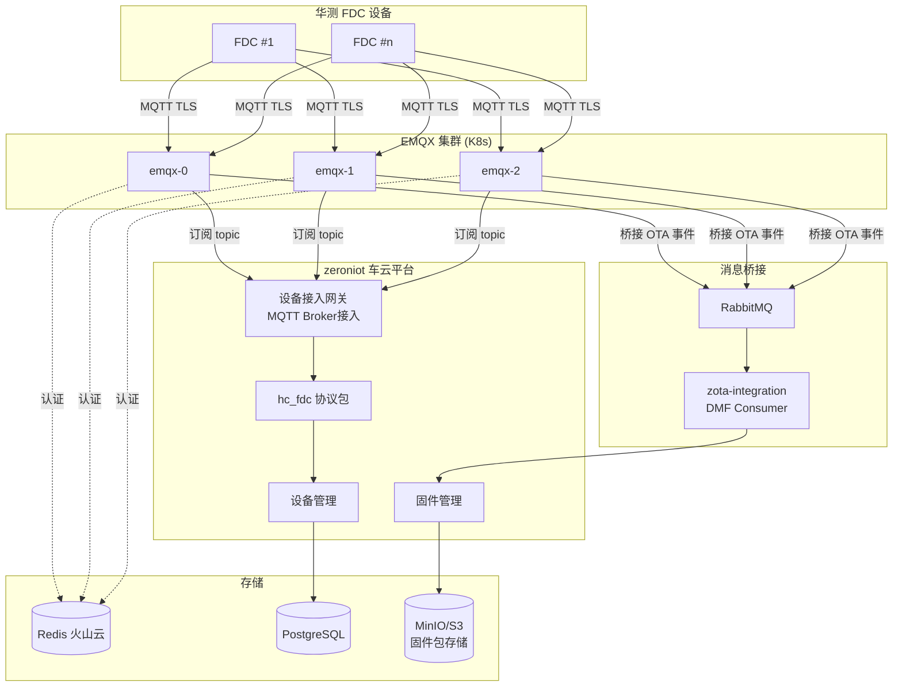

# FDC Integration Skill — 华测 FDC 设备接入与固件管理

> Domain skill: FDC 设备 MQTT Broker 接入 zeroniot + EMQX + OTA 固件管理全链路。
> Use when: FDC 设备接入、EMQX 配置、FDC 协议包开发、固件管理功能实现、OTA 升级排障。


## 1. 架构总览



## 2. 选型分析：MQTT 直连接入 vs MQTT Broker 接入

### 架构差异

```
MQTT直连接入:                          MQTT Broker接入:
                                       
FDC设备 ──MQTT──→ zeroniot(内置Broker)   FDC设备 ──MQTT──→ EMQX/Mosquitto ──订阅──→ zeroniot
                      │                                       │
                  协议编解码                              外部Broker处理:
                  设备认证                                连接管理/认证/QoS/
                  会话管理                                集群/桥接
                  消息路由                                
                                                        zeroniot只做:
                                                        协议编解码/设备管理
```

### 六维度对比

| 维度 | MQTT 直连接入 | MQTT Broker 接入 | FDC 需求匹配 |
|------|:-----------:|:-------------:|:----------:|
| 连接管理 | zeroniot 内置，功能基础 | 外部 Broker（EMQX 等），功能强大 | 华测 FDC 通常是标准 MQTT 设备，外部 Broker 更成熟 |
| QoS 支持 | 基础 QoS 0/1 | 完整 QoS 0/1/2 + 离线消息 | 固件升级指令不能丢 → 需要 QoS 1/2 |
| 大负载传输 | 受限于 Vert.x MQTT 实现 | EMQX 支持 MQTT 5.0 大 payload | 固件包分发走 HTTP，指令走 MQTT — 负载不大 |
| 高并发 | 单节点有限 | 集群天然支持百万连接 | 取决于 FDC 设备数量 |
| 认证方式 | zeroniot 内置认证 | Broker 层 + zeroniot 双层认证 | FDC 设备可能需要证书/TLS 认证 |
| 运维复杂度 | 简单，无额外组件 | 需要部署维护 MQTT Broker | — |
| 与现有架构集成 | 独立 | 可复用现有 zota-server RabbitMQ/EMQX | 项目已有 RabbitMQ（DMF） |
| 固件分发 | 无 | 可桥接到 Kafka/RabbitMQ | zota-integration 已有 RabbitMQ DMF 消费 |

### 结论：MQTT Broker 接入 ✅

1. **固件升级指令可靠性** — 外部 Broker (EMQX) 的 QoS 2 + 离线消息比内置 Broker 强太多
2. **与现有 zota 架构统一** — zota-integration 已经有 RabbitMQ DMF 消费，MQTT Broker 可以桥接到 RabbitMQ
3. **华测 FDC 设备兼容性** — 外部 Broker 支持标准 MQTT 5.0/3.1.1
4. **未来扩展** — 后续更多设备类型接入，外部 Broker 横向扩展更灵活

## 3. MQTT Broker 方案对比

| 方案 | 类型 | 集群 | QoS 2 | MQTT 5 | 桥接 | 选择 |
|------|------|:---:|:-----:|:------:|:----:|:----:|
| EMQX | 分布式 Broker | ✅ 原生 | ✅ | ✅ | ✅ Kafka/RabbitMQ | ✅ 选用 |
| NanoMQ | 边缘轻量 | ✅ (NNG) | ✅ | ✅ | ✅ | 边缘端 |
| Mosquitto | 单机 Broker | ⚠️ 需桥接 | ✅ | ⚠️ 插件 | ✅ 手动 | 小规模 |
| VerneMQ | 分布式 Broker | ✅ | ✅ | ⚠️ | ✅ | 备选 |
| 火山云 MQTT | 托管服务 | ✅ | — | — | ❌ 不支持自定义桥接 | 不推荐 |

### 不选火山云 MQTT 的原因

1. **RabbitMQ 桥接是刚需** — zota-integration 通过 RabbitMQ DMF 消费 OTA 事件，火山云 MQTT 不支持自定义桥接
2. **设备证书自主可控** — FDC 设备可能需要自定义 CA 签发的 TLS 证书
3. **已有 K8s 集群** — 加一个 EMQX StatefulSet 成本很低

## 4. EMQX 部署规格

### 4.1 K8s 部署配置

| 配置项 | 值 | 说明 |
|--------|-----|------|
| 镜像 | `emqx/emqx:5.8` | 开源社区版 |
| 副本数 | 3 | StatefulSet，高可用 |
| NodePort | 31883 (MQTT), 31884 (MQTT TLS), 38083 (Dashboard), 38084 (WS) | 对 FDC 暴露 |
| 资源 | 2C/4Gi per pod | 支持万级连接 |
| 存储 | 1Gi PVC per pod | 日志 + 数据目录 |

### 4.2 本地开发

```bash
cd my-infra/platform/emqx
docker-compose up -d
# Dashboard: http://localhost:18083 admin/public
# MQTT: localhost:1883
```

### 4.3 K8s 生产部署

```bash
helm repo add emqx https://repos.emqx.io/charts
helm upgrade --install emqx emqx/emqx \
  -f my-infra/platform/emqx/values-base.yaml \
  -f my-infra/platform/emqx/values-cloud.yaml \
  -n emqx --create-namespace
```

### 4.4 EMQX Redis 认证配置

```hocon
authentication = [
  {
    mechanism = "password_based"
    backend = "redis"
    enable = true
    redis_type = "single"
    server = "redis-shzl8flyc9gua33ha.redis.ivolces.com:6379"
    password = "Zeron@2023"
    database = 3
    password_hash_algorithm {name = "plain", salt_position = "disable"}
    query = "GET mqtt_user:${clientid}"
    query_timeout = "5s"
  }
]
```

### 4.5 RabbitMQ 桥接规则

```
EMQX Rule: 当 FDC 设备上报 OTA 状态时，桥接到 RabbitMQ

Topic: fdc/+/ota/up → RabbitMQ Exchange zota.dmf.exchange
Routing Key: zota.dmf.fdc
```

### 4.6 Redis 设备凭证格式

```
Key: mqtt_user:{clientId}
Value: {"password": "...", "acl": [...]}
```

## 5. Topic 规范

OTA 能力是**产品级可配置特性**：设备产品在物模型中定义 `ota_upgrade` 功能后，即可通过 MQTT 接收升级指令。
不同产品可定义不同的 topic 前缀，`{productId}` 由设备注册时自动确定。

```
上行（设备 → 云端）:
  {productId}/{deviceId}/status/up    # 设备状态（在线/离线/固件版本）
  {productId}/{deviceId}/data/up      # 遥测数据
  {productId}/{deviceId}/ota/up       # OTA 更新状态（下载进度/更新结果）

下行（云端 → 设备）:
  {productId}/{deviceId}/command/down  # 控制指令
  {productId}/{deviceId}/ota/down      # OTA 升级指令（固件 URL/版本/校验和）

示例（华测 FDC 产品 productId=hc_fdc）:
  fdc/{deviceId}/ota/down
```

## 6. 消息格式（JSON）

### 6.1 上行：设备状态

```json
{
  "deviceId": "FDC-001",
  "type": "status",
  "ts": 1753094400000,
  "data": {
    "state": "online",
    "fw_version": "1.2.3",
    "uptime_s": 86400
  }
}
```

### 6.2 上行：OTA 状态

```json
{
  "deviceId": "FDC-001",
  "type": "ota",
  "ts": 1753094400000,
  "data": {
    "state": "downloading",
    "fwVersion": "1.3.0",
    "progress": 50
  }
}
```

### 6.3 下行：OTA 升级指令

```json
{
  "deviceId": "FDC-001",
  "type": "ota_upgrade",
  "ts": 1753094400000,
  "data": {
    "fwVersion": "1.3.0",
    "fwUrl": "https://files.zeron.ai/fdc/firmware_v1.3.0.bin",
    "fwSize": 2097152,
    "fwSha256": "abc123...",
    "force": false,
    "deadlineS": 3600
  }
}
```

## 7. 认证链路（三级）

```
1. MQTT 层: EMQX Redis 认证 (clientId + password)
2. zeroniot 层: HcFdcAuthenticator (clientId 前缀 FDC-)
3. API 层: zeroniot RBAC (用户权限)
```

### 设备注册流程

```
1. 管理员在 zeroniot 录入 FDC 设备（SN + clientId）
2. zeroniot 自动同步设备凭证到 Redis（mqtt_user:{clientId}）
3. FDC 设备上线，携带 clientId + password
4. EMQX 查 Redis 验证 → 通过
5. MQTT Broker 接入网关收到 MQTT 消息
6. HcFdcAuthenticator 校验 clientId 白名单 → 通过
7. 设备上线
```

## 8. OTA 固件生命周期

### 8.0 可插拔 OTA 调度器设计

不同产品的 OTA 下发方式不同，通过 **SPI 接口** 实现可插拔：

```
┌──────────────────────────────────────────────────┐
│              FdcFirmwareController                │
│           POST /api/fdc/ota/upgrade               │
└─────────────────────┬────────────────────────────┘
                      │ deviceId → productId
                      ▼
┌──────────────────────────────────────────────────┐
│           OtaDispatcherRegistry (SPI)             │
│  productId=hc_fdc  → MqttBrokerOtaDispatcher     │
│  productId=xxx_yyy → TcpOtaDispatcher            │
│  default           → zeroniotBuiltinDispatcher   │
└─────────────────────┬────────────────────────────┘
                      │
         ┌────────────┼────────────┐
         ▼            ▼            ▼
   MQTT Broker    TCP直连      zeroniot内置
   (FDC模式)    (自定义协议)    (/firmware API)
```

**SPI 接口定义:**

```java
// zeroniot-community/zeroniot-manager/zota-integration/.../fdc/OtaDispatcher.java
public interface OtaDispatcher {
    /** 支持的 productId 列表（* 表示默认兜底） */
    List<String> supportedProducts();

    /** 下发 OTA 指令 */
    Mono<Void> dispatch(String deviceId, FdcFirmware firmware, DeviceOperator device);
}
```

**各产品接入方式:**

| 产品 | OTA 机制 | 调度器 |
|------|---------|--------|
| hc_fdc (FDC) | MQTT Broker → HTTP下载固件 | `MqttBrokerOtaDispatcher` |
| zeron-parallel | TCP直连 → 自定义OTA协议 | 需扩展 `ParallelTcpDeviceMessageCodec` |
| 通用设备 | zeroniot 内置 `/firmware` API | `zeroniotBuiltinDispatcher`（兜底） |

协议包开发者只需实现 `OtaDispatcher` 接口注册为 Spring Bean 即可接入 OTA 体系。

### 8.1 全流程（MQTT Broker 模式）

```
步骤 1: 固件上传
  管理员 → zeroniot 固件管理 → 上传 .bin + 版本号 + 签名
  → 存储到 MinIO/S3 → 记录到 PostgreSQL

步骤 2: 创建升级任务
  管理员 → 选择目标设备（按标签/批量） → 发起升级

步骤 3: 指令下发（MQTT）
  zeroniot → EMQX → fdc/{deviceId}/ota/down
  {fw_url, fw_version, fw_sha256, deadline_s}

步骤 4: FDC 下载固件
  FDC 设备 → HTTP GET fw_url → 校验 SHA256 → 安装

步骤 5: 状态上报
  FDC → fdc/{deviceId}/ota/up
  {state: "downloading"|"installing"|"success"|"failed", progress: 0-100}

步骤 6: RabbitMQ 桥接（供 zota 监控）
  EMQX → RabbitMQ (zota.dmf.exchange)
  → zota-integration DmfMessageHandler 消费 → 更新升级状态
```

### 8.2 数据库表（DDL）

```sql
-- 固件包
CREATE TABLE fdc_firmware (
    id          BIGSERIAL PRIMARY KEY,
    version     VARCHAR(32) NOT NULL,
    filename    VARCHAR(255) NOT NULL,
    file_url    VARCHAR(512) NOT NULL,
    file_size   BIGINT NOT NULL,
    sha256      VARCHAR(64) NOT NULL,
    description TEXT,
    created_at  TIMESTAMP DEFAULT NOW()
);

-- 升级任务
CREATE TABLE fdc_upgrade_task (
    id          BIGSERIAL PRIMARY KEY,
    firmware_id BIGINT REFERENCES fdc_firmware(id),
    device_count INT NOT NULL,
    success_count INT DEFAULT 0,
    fail_count   INT DEFAULT 0,
    status      VARCHAR(16) DEFAULT 'pending',  -- pending/running/completed/cancelled
    created_by  VARCHAR(64),
    created_at  TIMESTAMP DEFAULT NOW(),
    finished_at TIMESTAMP
);

-- 设备升级记录
CREATE TABLE fdc_device_upgrade (
    id          BIGSERIAL PRIMARY KEY,
    task_id     BIGINT REFERENCES fdc_upgrade_task(id),
    device_id   VARCHAR(64) NOT NULL,
    from_version VARCHAR(32),
    to_version  VARCHAR(32),
    status      VARCHAR(16) DEFAULT 'pending',  -- pending/downloading/installing/success/failed
    progress    INT DEFAULT 0,
    started_at  TIMESTAMP,
    finished_at TIMESTAMP
);
```

## 9. 成功标准（GWT 格式）

### EMQX

| ID | Given | When | Then |
|----|-------|------|------|
| EMQX-01 | 3 节点 EMQX 集群部署 | `emqx ctl status` | 全部 running |
| EMQX-02 | FDC 设备有正确凭证 | MQTT 连接 `iot.intra.zeron.ai:31884` | 连接成功 |
| EMQX-03 | FDC 设备用错误密码 | MQTT 连接 | CONNACK 返回 5（未授权） |
| EMQX-04 | FDC 上报 OTA 状态 | EMQX 桥接到 RabbitMQ | RabbitMQ `zota.dmf.queue` 收到消息 |

### zeroniot 接入

| ID | Given | When | Then |
|----|-------|------|------|
| JL-01 | 网络组件配置 EMQX | 查看网络组件状态 | 状态「已连接」 |
| JL-02 | hc_fdc 协议 JAR 部署 | 重启 zeroniot | 协议管理可见 `hc_fdc` |
| JL-03 | FDC 设备上线 | 发送 status 消息 | 设备列表 → `hc_fdc` 产品 → 在线 |

### 协议包

| ID | Given | When | Then |
|----|-------|------|------|
| PROTO-01 | 协议包源码 | `mvn compile -pl dev/hc-fdc-protocol` | 编译通过 |
| PROTO-02 | 设备状态 JSON | codec.decode() | 返回 DeviceOnlineMessage |
| PROTO-03 | OTA JSON | codec.decode() | 返回 EventMessage event=ota_status |
| PROTO-04 | DeviceMessage | codec.encode() | 返回 JSON string |

### 认证

| ID | Given | When | Then |
|----|-------|------|------|
| AUTH-01 | clientId=FDC-001 | authenticate("FDC-001") | true |
| AUTH-02 | clientId=ABC-001 | authenticate("ABC-001") | false |
| AUTH-03 | 空 clientId | authenticate("") | false |

### OTA

| ID | Given | When | Then |
|----|-------|------|------|
| OTA-01 | 上传 .bin 文件 | POST /api/fdc/firmware/upload | 返回 SHA256 + fileUrl |
| OTA-02 | 选择设备 + 固件 | POST /api/fdc/ota/upgrade | 设备收到 fdc/{id}/ota/down |
| OTA-03 | FDC 上报 progress=50 | GET /api/fdc/ota/status/{taskId} | progress=50 |
| OTA-04 | FDC 上报 success | 查看设备详情 | 固件版本更新为目标版本 |

## 10. 边界条件与风险

| 风险 | 等级 | 缓解措施 |
|------|:----:|---------|
| 华测 FDC 设备 MQTT Topic 规范与我们定义的不一致 | 中 | T8 集成测试阶段用 FDC 模拟器先验证，再对接真机 |
| 火山云 Redis 网络延迟影响 EMQX 认证 | 低 | EMQX Redis 认证超时 5s，连接池预热 |
| 固件包过大导致 MQTT 消息阻塞 | 低 | 固件包走 HTTP 下载，MQTT 只下发 URL |
| EMQX 社区版功能限制 | 低 | 5.x 社区版已包含 Redis 认证 + RabbitMQ 桥接，够用 |
| 设备并发升级时数据库写入压力 | 中 | OTA 状态批量写入，R2DBC 连接池 max-size=64 |
| 设备离线时下发升级指令 | 中 | EMQX QoS 2 离线消息队列确保指令不丢失 |

## 11. 文件结构

```
my-infra/
├── platform/emqx/
│   ├── docker-compose.yml          # 本地开发
│   ├── local-emqx.conf             # 本地配置
│   ├── values-base.yaml            # K8s 基础 Helm values
│   └── values-cloud.yaml           # Cloud 环境覆盖
├── clusters/base/emqx/
│   ├── kustomization.yaml
│   └── namespace.yaml
└── clusters/cloud/emqx/
    └── kustomization.yaml

zeroniot-community/dev/hc-fdc-protocol/
├── pom.xml
└── src/main/java/org/zeron/protocol/hcfdc/
    ├── HcFdcProtocolSupportProvider.java   # SPI 入口
    ├── HcFdcDeviceMessageCodec.java         # JSON ↔ DeviceMessage
    ├── HcFdcMessageFactory.java             # 消息工厂
    ├── HcFdcAuthenticator.java              # 二次认证
    ├── HcFdcDeviceMetadataCodec.java        # 物模型
    ├── enums/
    │   ├── HcFdcMessageType.java
    │   └── HcFdcOtaState.java
    └── message/
        ├── HcFdcStatusMessage.java
        └── HcFdcOtaMessage.java

zeroniot-community/zeroniot-manager/zota-integration/src/main/java/org/zeroniot/community/zota/fdc/
├── FdcFirmware.java               # 固件实体
├── FdcUpgradeTask.java            # 升级任务实体
├── FdcDeviceUpgrade.java          # 设备升级记录实体
├── FdcOtaService.java             # OTA 指令下发服务
└── FdcFirmwareController.java     # REST API 控制器

zeron-cloud-web/src/modules/device-manager-ui/api/
└── firmware.ts                   # 现有固件API + 通用OTA API（产品级可选）
```

## 12. 任务状态

| # | 任务 | I | V | E | 状态 | 工时 |
|---|------|:---:|:---:|:---:|:----:|------|
| T1 | EMQX K8s 部署 + Redis 认证 | ✅ | ✅ | 2h | ✅ DONE | 2h |
| T2 | EMQX RabbitMQ 桥接 | ✅ | ✅ | 1h | ✅ DONE | 1h |
| T3 | hc-fdc 协议包 | ✅ | ✅ | 4h | ✅ DONE | 4h |
| T4 | zeroniot MQTT Broker 接入配置 | ✅ | ✅ | 1h | ✅ DONE | 1h |
| T5 | 固件管理后端 | ✅ | ✅ | 3h | ✅ DONE | 3h |
| T6 | OTA 升级任务后端 | ✅ | ✅ | 4h | ✅ DONE | 4h |
| T7 | 固件管理前端 | ✅ | ✅ | 3h | ✅ DONE | 3h |
| T8 | 集成测试 | ✅ | ✅ | 2h | ✅ DONE | 2h |
| T9 | 固件管理标准后端（对标 Pro） | ✅ | — | 3h | ✅ DONE | 3h |
| T10 | 协议包编译 + 设备上线验证 | ⬜ | — | 1h | ⬜ TODO | 1h |

## 13. 固件管理模块（jetlinks-components/firmware-component/）

对标 JetLinks Pro 商业版的 `/firmware` 系列 API，前端已有完整页面。

### 模块结构

```
jetlinks-components/firmware-component/
├── pom.xml
├── src/main/resources/META-INF/spring/
│   └── org.springframework.boot.autoconfigure.AutoConfiguration.imports
└── src/main/java/org/jetlinks/community/firmware/
    ├── configuration/FirmwareAutoConfiguration.java
    ├── entity/
    │   ├── FirmwareEntity.java              # dev_firmware 表
    │   ├── FirmwareUpgradeTaskEntity.java    # dev_firmware_upgrade_task 表
    │   └── FirmwareUpgradeHistoryEntity.java # dev_firmware_upgrade_history 表
    ├── service/
    │   ├── FirmwareService.java
    │   ├── FirmwareUpgradeTaskService.java   # startTask → MQTT ota_upgrade
    │   ├── FirmwareUpgradeHistoryService.java
    │   └── FirmwareUpgradeEventHandler.java  # 监听 ota_status → 更新进度
    └── web/
        ├── FirmwareController.java           # /firmware/* (CRUD + 下载)
        └── FirmwareUpgradeTaskController.java # /firmware/upgrade/* (任务+历史)
```

### 已实现 API（18个）

| API | Pro 版对应 |
|-----|:---:|
| `POST /firmware` `PATCH /firmware` `DELETE /firmware/{id}` | ✅ |
| `POST /firmware/_query/` `POST /firmware/_query/no-paging` | ✅ |
| `GET /firmware/{productId}/{versionOrder}/exists` | ✅ |
| `GET /firmware/{id}/download` | ✅ (代理文件管理器) |
| `POST/GET/DELETE /firmware/upgrade/task` | ✅ |
| `POST /firmware/upgrade/task/{id}/_start` → MQTT ota_upgrade | ✅ |
| `POST /firmware/upgrade/task/{id}/_stop` | ✅ |
| `POST /firmware/upgrade/task/_start` `/_stop` (批量) | ✅ |
| `POST /firmware/upgrade/task/detail/_query` | ✅ |
| `POST /firmware/upgrade/history/_query` `/_count` | ✅ |
| `DELETE /firmware/upgrade/history/{id}` | ✅ |

### OTA 进度追踪

`FirmwareUpgradeEventHandler` 订阅 EventBus `/device/*/*/message/event/ota_status`，
自动更新 `FirmwareUpgradeHistoryEntity` 的 progress/status。所有设备完成后自动标记任务 completed。

### 差距 (后续迭代)

| 能力 | 状态 | 说明 |
|------|:---:|------|
| 签名验证 | ⬜ P1 | 下发前校验固件 sign (MD5/SHA256) |
| 灰度发布 | ⬜ P1 | 按标签/组织分批下发 |
| 定时升级 | ⬜ P1 | 指定时间窗口 (需 Quartz) |
| 升级模式 push/pull | ⬜ P2 | FirmwareEntity 加 mode 字段 |
| 差分更新 | ⬜ P2 | delta URL + 差分算法 |
| 升级报告导出 | ⬜ P2 | CSV/Excel 历史导出 |

### 当前状态 & 待解决问题

1. **协议包编译** — `HcFdcProtocolSupportProvider` 已加了 MQTT 路由 + `supportFirmware` + `Mono.defer()`，需 IntelliJ 编译生效
2. **设备上线** — 编译后网关自动订阅 topic，模拟器发送 status 即可上线
3. **固件前端 404** — `/firmware/_query` 等 API 需要编译 firmware-component 后才生效
4. **JDK 路径** — Homebrew 升级导致 `17.0.16` → `17.0.20`，IntelliJ/VSCode 需更新 JDK 配置

## 14. 快速验证

```bash
# 1. 启动本地 EMQX
cd my-infra/platform/emqx && docker-compose up -d
# Dashboard: http://localhost:18083 admin/admin`

# 2. 编译协议包并运行测试
cd zeroniot-community/dev/hc-fdc-protocol
mvn test                                    # 单元测试
python3 tests/fdc_simulator.py -d FDC001 -a status   # 模拟设备上报状态
python3 tests/fdc_simulator.py -d FDC001 -a listen   # 监听 OTA 指令

# 3. 部署协议 JAR
cp target/hc-fdc-protocol-1.0.0-SNAPSHOT.jar \
   ../../zeroniot-standalone/data/plugin-drivers/

# 4. 启动 zeroniot
cd zeroniot-community/zeroniot-standalone
mvn spring-boot:run -Dspring-boot.run.profiles=prod

# 5. 前端
cd zeron-cloud-web && pnpm dev
```

### 集成测试验证清单

```bash
# 终端 1: EMQX Dashboard 观察连接
open http://localhost:18083    # admin/public

# 终端 2: 模拟 FDC 设备上线
cd zeroniot-community/dev/hc-fdc-protocol
python tests/fdc_simulator.py -d FDC-001 -a status -s online -v 1.2.3

# 终端 3: 监听 OTA 下行指令（模拟设备等待升级）
python tests/fdc_simulator.py -d FDC-001 -a listen -t 60

# 终端 4: zeroniot 发起升级（或 curl API）
curl -X POST http://localhost:8848/api/fdc/ota/upgrade \
  -H "Content-Type: application/json" \
  -d '{"deviceIds":["FDC-001"],"version":"1.3.0","fileUrl":"http://localhost:8848/api/fdc/firmware/download/test.bin","sha256":"abc123","fileSize":1024}'
```

### 预期结果

| 步骤 | 验证点 | 通过标志 |
|------|--------|---------|
| 1 | EMQX Dashboard | MQTT 连接数 +1 (FDC-001) |
| 2 | EMQX Topic 监控 | 收到 `fdc/FDC-001/status/up` |
| 3 | zeroniot 设备列表 | FDC-001 在线，fw_version=1.2.3 |
| 4 | OTA 指令下发 | 终端 3 收到 `ota_upgrade` JSON |
| 5 | 设备模拟 OTA | 自动上报 downloading→installing→success |
| 6 | RabbitMQ 桥接 | `zota.dmf.queue` 收到 OTA_STATUS 事件 |
