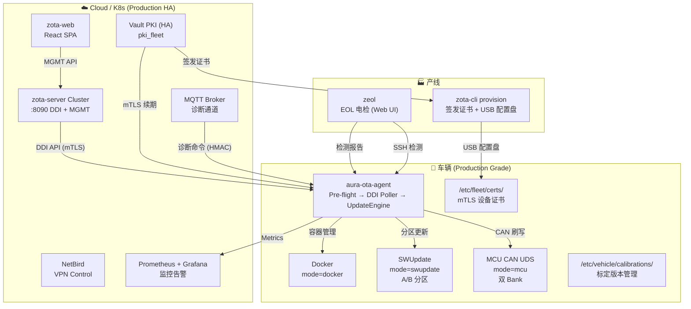

# ZOTA — 整车 OTA + 诊断平台

## 一句话
以 zota-server 为核心，车端 aura-ota-agent + zota-cli 协同，覆盖 Docker 容器更新、A/B 分区系统更新、产线 EOL、远程诊断、标定版本管理的统一平台。

## When to Use
- 调试：OTA 更新失败、DDI 轮询异常、容器启动失败、证书过期
- 开发：修改 `aura-ota-agent/`、`zota-cli/`、`hawkbit/` 任一组件的代码
- 审查：ZOTA 相关 PR review
- 运维：车辆升级、标定下发、远程诊断
- 架构：新增更新模式（SWUpdate/RAUC）、新增诊断能力

## 变更流程

> 大改先提案，小修直接干。改 ZOTA 代码前按此流程走。

| 步骤 | 做什么 | 产物 |
|------|--------|------|
| 1. **explore** | 读 SKILL.md + 相关代码 + 现有架构文档，理解现状 | 方案思路 |
| 2. **propose** | 写清楚：改什么文件、为什么改、如何回滚 | 更新关键文件表 |
| 3. **apply** | 实现 + 验证：`make build-all && ./bin/zota-cli doctor` 确认正常 | 代码变更 |
| 4. **archive** | 沉淀：新故障模式 → FM；新约束 → 更新 references/ | 更新 references/ |

**小修免提案**（typo、日志格式、配置调优）。**大改必提案**（新增更新模式、改 DDI 协议、新增诊断通道）。

## 系统全景



## 关键文件

| 文件 | 角色 | 易错点 |
|------|------|--------|
| `aura-ota-agent/cmd/agent/main.go` | Agent 入口，编排 bootstrap → DDI poll → 更新 | bootstrap token 用后必须删除 |
| `aura-ota-agent/internal/ddi/client.go` | zota-server DDI 客户端，Base Poll + Deployment | Feedback 5 次重试，超时策略 |
| `aura-ota-agent/internal/ddi/poller.go` | 轮询循环，支持 sleep 自适应 | `PollOnce` vs `Run` 两种模式 |
| `aura-ota-agent/internal/updater/manager.go` | 更新编排：pull→verify→stop→start→health | `SafeSwitch` 原子操作 |
| `aura-ota-agent/internal/docker/manager.go` | Docker CLI 封装，路径自适应 | `dockerPath()` 兼容 systemd 最小 PATH |
| `aura-ota-agent/internal/docker/cosign.go` | Cosign 签名验证 | pub key 为空时跳过验证（开发模式） |
| `aura-ota-agent/internal/health/checker.go` | 容器/Ros2 健康检查 | topic 列表空数组 = 仅检查容器 |
| `aura-ota-agent/internal/bootstrap/bootstrap.go` | 首次开机 PKI + VPN | `FLEET_CERT_DIR` env 覆盖路径 |
| `aura-ota-agent/internal/integration/integration.go` | systemd 集成 | 必须以 root 运行 |
| `zota-cli/internal/cli/update.go` | 单次 DDI 轮询升级 | 退出码 0/1/2 区分 applied/failed/noop |
| `zota-cli/internal/cli/eol.go` | EOL 命令行入口 | `--mock` 使传感器模拟通过 |
| `zota-cli/internal/eol/eol.go` | EOL 检测引擎（8 种检测） | docker_exec 格式: `"容器名:命令"` |
| `zota-cli/internal/cli/cert.go` | 证书管理（签发/查询/续期/吊销） | fleet-registry.yaml 路径 |
| `zota-cli/internal/cli/provision.go` | 产线 USB 配置盘生成 | online/offline/auto-issue 三种模式 |
| `hawkbit/hawkbit-monolith/.../application.properties` | zota-server 服务端配置 | DDI token auth + gateway token 双模式 |
| `zota-web/src/features/` | 管理 UI | Dashboard / Targets / Distributions / Rollouts |
| `ota/scripts/build-sign-publish.sh` | 镜像构建→签名→注册 zota-server | 自动创建 SM Type 和 Module |
| `zota-repo/` | 软件版本管理平台 | 版本目录、兼容矩阵、硬件清单、漂移检测 |
| `zeol/` | EOL 电检工具 (Go + React) | Web UI + SSH 连接池 + 17 checker + Pipeline 引擎 + SQLite + 远程加载 + 操作员身份 + 审计日志 |
| `zeol/internal/report/store.go` | SQLite 存储：报告 + 审计日志双表 | WAL 模式，报告 + audit_logs 同库 |
| `zeol/internal/server/server.go` | HTTP API：操作员 PIN 认证 + 会话管理 + 审计 + metrics | `POST /api/auth/login` (PIN验证) + `GET /api/metrics` (Prometheus) |
| `zeol/internal/cli/operator.go` | `zeol operator add/list/remove` 操作员管理 | PIN 通过 SHA-256 哈希存储 |
| `zeol/internal/report/store.go` | SQLite：报告 + 审计 + 操作员三表 | operators 表存 pin_hash，VerifyOperator 验证 |
| `zeol/internal/pipeline/loader.go` | Pipeline 加载器，版本兼容校验 | `min_zeol_version` 不满足则拒绝加载 |
| `zeol/internal/pipeline/remote.go` | 远程 Pipeline 加载 (zota-repo API) | 网络不可用时降级到本地 pipelines/ |
| `zeol/internal/checker/ssh_pool.go` | SSH 连接池 + 自动重连 | 断线自动重连 3 次，指数退避 |
| `zeol/internal/checker/registry.go` | Checker 注册表，未知类型优雅降级 | 未知 checker → skipped（不阻塞 pipeline） |
| `zeol/internal/cli/version.go` | `zeol version --check` 版本检查 | 对比 zota-repo 最新版本 |
| `zeol/internal/cli/reload.go` | `zeol reload` 列出远程 pipeline | 显示各 pipeline 兼容性 |
| `aura/src/ztd/ztd_network/ztd_rtsp/src/vehicle/rtsp_stream.cpp` | RTSP Server：appsrc→NVENC→rtph264pay | gop-size 需 probe 设置，NVENC 不认 key-int-max |
| `aura/src/ztd/ztd_network/ztd_rtsp/src/vehicle/push_node.cpp` | TRRO 推流：rtspsrc→appsink→TRRO SDK | GStreamer 1.16 无法发 RTCP PLI，降级为 IDR 缓存重发 |

## 当前能力矩阵（代码实际状态 / 生产目标）

| 能力 | 状态 | 代码位置 | 生产级要点 |
|------|:---:|------|------|
| **Docker 容器 OTA** | ✅ 完成 | `aura-ota-agent/internal/docker/` | cosign 验签 + SafeSwitch + 健康检查 |
| **zota-server DDI 对接** | ✅ 完成 | `aura-ota-agent/internal/ddi/` | 5 次重试 Feedback + sleep 自适应 |
| **Cosign 签名验证** | ✅ 完成 | `aura-ota-agent/internal/docker/cosign.go` | 生产 MUST 配置 pub key |
| **健康检查** | ✅ 完成 | `aura-ota-agent/internal/health/` | 容器 + ROS2 topic + systemd |
| **PKI 证书 Bootstrap** | ✅ 完成 | `aura-ota-agent/internal/bootstrap/` | Vault 直连 + zota-server 代理双模式 |
| **证书管理 (CLI)** | ✅ 完成 | `zota-cli/internal/cli/cert.go` | 签发/查询/续期/吊销 + fleet-registry |
| **产线 USB 配置盘** | ✅ 完成 | `zota-cli/internal/cli/provision.go` | online/offline/auto-issue |
| **EOL 电检 (CLI)** | ✅ 完成 | `zota-cli/internal/eol/` | 8 种检测类型 |
| **EOL 电检 (zeol)** | ✅ 完成 | `zeol/` | Web UI + 17 checker + Pipeline + SQLite + sync + 远程加载 + SSH自动重连 + 版本兼容 + 操作员身份 + 审计日志 |
| **多模块管理** | ✅ 完成 | `zota-cli update --config a,b,c` | 批量单次升级 |
| **暂停/恢复/回滚** | ✅ 完成 | `zota-cli pause/resume/rollback` | 运维友好 |
| **zota-server 管理 UI** | ✅ 完成 | `zota-web/` | Dashboard/Targets/Rollouts |
| **SWUpdate A/B 分区** | ✅ 代码 | `internal/swupdate/` | 断电保护 + bootloader 3次回退 (待实车) |
| **MCU UDS 刷写** | ✅ 代码 | `internal/mcu/` | CAN 总线 + 双 Bank 保护 (待硬件) |
| **Agent 自升级** | ✅ 代码 | `internal/selfupgrade/` | 原子替换 + systemd 恢复 |
| **远程诊断平台** | ✅ 完成 | `internal/diag/` | MQTT + HMAC + 11命令白名单 (11/11 实现) |
| **Pre-flight 检查** | ✅ 完成 | `internal/preflight/` | 磁盘/电池/车辆状态/更新互斥锁 |
| **标定版本上报** | ✅ 完成 | `internal/calibration/` | DDI configData 自动上报 |
| **Prometheus Metrics** | ✅ 完成 | `internal/metrics/` | 成功率/延迟/预检失败/证书到期 |
| **zota-repo 平台** | ✅ 完成 | `zota-repo/` | 77 API + 14 UI feature + K8s manifests |
| **zota-repo UI (React)** | ✅ 完成 | `zota-repo/web/` | Ant Design 6 + React 19 + TypeScript |
| **JetLinks 集成** | ✅ 代码 | `jetlinks-community/.../zota-integration/` | DMF → 设备属性更新 |
| **K8s 部署 (ArgoCD)** | ✅ 完成 | `cicd/argocd/` | 4 Applications + sync-wave |
| **CI/CD 流水线** | ✅ 完成 | `.github/workflows/` | Agent CI + Calibration CI |
| **Grafana 监控** | ✅ 完成 | `monitoring/` | 8 面板 + 8 告警规则 + ServiceMonitor |
| **安全合规文档** | ✅ 完成 | `doc/security/` | ISO 21434 + GB/T 32960 + UN R156/R155 |
| **RAUC 支持** | 🔮 预留 | `MultiModeHandler` 接口 | 备选方案 |
| **zota-server 集群 HA** | 🔮 Phase 1 | K8s Deployment + PG HA | 3副本 (待生产集群) |
| **实车验证** | ⬜ Phase 1 | SWUpdate/UDS/CAN 端到端 | 需硬件 |

## 核心设计原则

1. **zota-server 是唯一 OTA 服务端**：DDI API 标准协议，不引入第二套更新系统
2. **车端三模式**：Docker 容器（数采车）、SWUpdate 分区（L4 智驾车）、MCU UDS 刷写（所有车型），共享同一 DDI 客户端
3. **签名不可跳过**（生产环境）：所有更新包必须签名验证（Docker: cosign / SWUpdate: PKCS#7 / MCU: SHA256+HMAC）
4. **Pre-flight 检查**：更新前 MUST 检查磁盘/车辆状态/电池/并发，任一不满足则拒绝
5. **自动回滚**：健康检查 3 次失败 → 自动回滚；SWUpdate bootloader 失败 → 切回 A 分区；MCU 自检失败 → 切回默认 Bank
6. **诊断与 OTA 联动**：诊断发现的问题可直接触发 zota-server 下发修复更新
7. **标定 = Software Module**：复用 zota-server 的版本管理、分发、灰度能力
8. **离线韧性**：车辆离线 action 不丢失，上线后按序执行；断电自动恢复或回滚
9. **Agent 常驻 + CLI 按需**：`aura-ota-agent` 后台持续轮询，`zota-cli` 按需手动操作
10. **可观测性**：Prometheus metrics + 告警 + 审计日志（满足 ISO 21434）
11. **zota-repo 只读 zota-server MGMT API**：zota-repo 不与车端直连。车辆通过 DDI configData 上报实际版本到 zota-server 属性，zota-repo 通过 MGMT API 只读查询 target attributes（实际状态）和 assigned DS（预期状态），计算漂移。车端唯一入口是 zota-server DDI。
12. **zeol Pipeline 版本兼容**：Pipeline YAML 声明 `min_zeol_version`，加载时版本不满足 → 拒绝加载。未知 checker 类型 → 标记 skipped（不阻塞 pipeline），确保 YAML 更新不破坏旧二进制。
13. **zeol 操作员 PIN 认证 + 滑动会话**：产线员工用工号+PIN登录。PIN SHA-256 哈希存储。会话滑动过期（30分钟无操作自动登出，每次 API 调用自动续期，12小时绝对上限）。所有操作记录审计日志。主管 `zeol operator add/remove` 管理操作员。zeol 不需要 Casdoor——台架单机工具，离线优先。
14. **zota-repo 接入 Casdoor**（规划中）：zota-repo 是云端多角色服务（工程师/发布经理/管理员），需要 OAuth2/OIDC + RBAC + SSO。Casdoor 提供统一身份管理。

## 配置速查

> 完整配置在 `aura-ota-agent/configs/config.example.yaml`。

| 配置项 | 默认 | 说明 |
|--------|------|------|
| `zota.url` | `http://10.8.201.14:8090` | zota-server DDI API 地址 |
| `zota.token` | — | Target Security Token |
| `zota.gateway_token` | — | Gateway Token（可选） |
| `zota.poll_interval_seconds` | 30 | DDI 轮询间隔 |
| `docker.container_name` | `zeron` | 目标容器名 |
| `docker.cosign_pub_key` | — | Cosign 公钥路径（空=跳过验证） |
| `health.check_topics` | `[]` | ROS2 Topic 健康检查列表 |
| `health.check_services` | `[]` | ROS2 Service 健康检查列表 |
| `bootstrap.vault_url` | — | Vault PKI 地址 |
| `bootstrap.vault_pki_path` | `pki_fleet` | Vault PKI mount |

## 常用命令

```bash
# ── 车端 ──

# Agent 状态
zota-cli status --all                          # 所有模块状态表
zota-cli status --config /etc/zota-cli/configs/camera.yaml

# 单次更新
zota-cli update --config camera,lidar,planning  # 多模块批量更新
zota-cli update --config /etc/zota-cli/configs/camera.yaml

# 运维操作
zota-cli pause                                   # 暂停轮询
zota-cli resume                                  # 恢复轮询
zota-cli rollback                                # 回滚到上一版本
zota-cli doctor                                  # 全量诊断
zota-cli reload                                  # 热重载配置

# 后台运行
zota-cli run --configs-dir /etc/zota-cli/configs

# ── 产线 ──

# EOL 检测（本地 pipeline）
zota-cli eol --vin TEST001 --config configs/eol.example.yaml --mock
zota-cli eol --vin MYVIN --config /etc/zota-cli/eol.yaml --json

# EOL 检测（zeol Web UI + 远程 pipeline）
zeol run --port 9101 --host 0.0.0.0                  # 启动 Web UI
zeol eol --vin ZSD001 --pipeline pipelines/factory-full.yaml

# zeol 运维
zeol version --check                                   # 检查新版本
zeol reload --server https://zota-repo.intra.zeron.ai # 查看远程 pipeline 兼容性
zeol sync                                              # 同步报告到 zota-repo

# zeol 操作员管理（主管执行，一次性初始化）
zeol operator add --id OP001 --name 张三 --pin 123456
zeol operator add --id SV001 --name 李四 --pin 654321 --role supervisor
zeol operator list
zeol operator remove --id OP001

# zeol 审计（查询操作记录）
curl http://localhost:9101/api/audit/logs               # 全部审计日志
curl "http://localhost:9101/api/audit/logs?operator_id=OP001"  # 按操作员过滤

# USB 配置盘
zota-cli provision --vin MYVIN --auto-issue
zota-cli provision --vin MYVIN --offline --cert-dir /tmp/certs

# ── 云端 ──

# zota-server 状态
curl -s -u admin:admin http://localhost:8090/rest/v1/targets | jq '.total'

# 构建发布
cd ota && bash scripts/build-sign-publish.sh 1.2.3

# Agent 部署
cd ota/ansible && ansible-playbook -i inventory/nvidia-10.10.4.112.yml playbooks/deploy-agent.yml
```

## 部署流程

### 涉及组件

| 组件 | 路径 | 部署方式 |
|------|------|---------|
| zota-server | `hawkbit/hawkbit-monolith/` | `docker compose up` 或 K8s |
| zota-web | `zota-web/` | `docker compose` 或 Nginx 静态 |
| aura-ota-agent | `aura-ota-agent/` | Ansible → 车端 |
| zota-cli | `zota-cli/` | Ansible → 车端 |
| Vault PKI | `my-infra/pki/` | K8s Helm |

### 部署顺序

```
Vault PKI ──→ zota-server ──→ zota-web
                              │
                  ┌───────────┘
                  ▼
          车端 Agent + CLI (Ansible)
```

## 参考文档

- [k8s-best-practices.md](references/k8s-best-practices.md) — K8s 部署最佳实践（安全/可维护/高效 + 检查清单）
- [gap-analysis.md](references/gap-analysis.md) — L4 量产就绪全面差距分析（P0/P1/P2 + 路线图 + 风险）
- [roadmap.md](references/roadmap.md) — 量产 L4 全能力交付路线图（5 Phase + 质量门）
- [spec-done-review.md](references/spec-done-review.md) — Spec Done 自检报告（GWT 覆盖 + Non-Goals + ADR 间隙）
- [proposal.md](references/proposal.md) — ZOTA 架构演进提案（代码 vs 文档差异分析）
- [specs.md](references/specs.md) — 功能规格（OTA/诊断/标定，含 GWT 场景）
- [design.md](references/design.md) — 技术设计方案（数据流/模块变更/DB schema）
- [tasks.md](references/tasks.md) — 任务拆分（依赖图/估时/验证方式）
- [product-guide.md](references/product-guide.md) — 产品功能手册（PM/QA/培训用）
- [project-report.md](references/project-report.md) — 项目汇报（里程碑/风险/进度）
- [architecture-evolution.md](references/architecture-evolution.md) — 架构演进（ADR/DB Schema/Roadmap）
- [ux-conventions.md](references/ux-conventions.md) — UX 设计规范（页面布局/统计区/表单/颜色/状态覆盖）
- [gstreamer-rtcp-limitation.md](references/gstreamer-rtcp-limitation.md) — GStreamer 1.16 rtspsrc keyframe 请求限制与升级路径
- [LOOP.md](LOOP.md) — ZOTA 运行态 Loop 协调 + 碰撞检测
