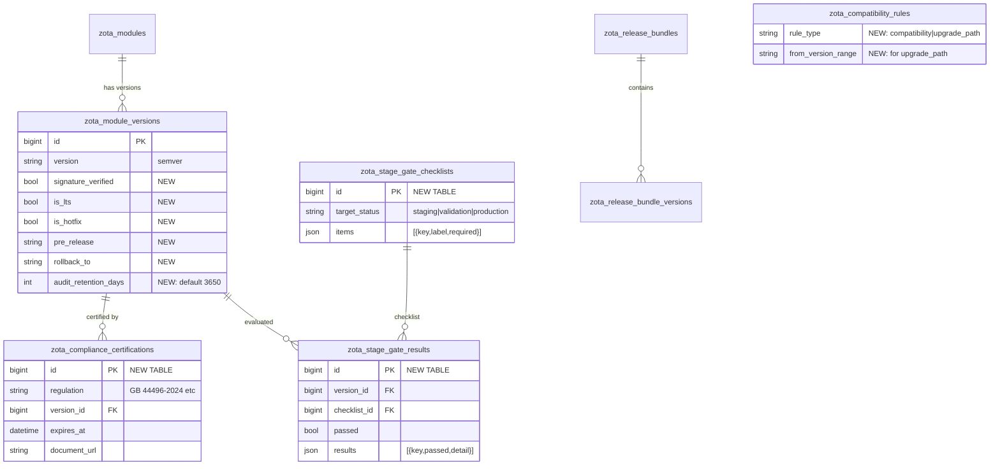

# ZOTA-REPO 架构演进 — L4 版本全生命周期

> **架构版本**: v2.0  
> **更新日期**: 2026-07-12  
> **关联 ADR**: semver-integration, upgrade-path, compliance-certifications

---

## 一、架构决策记录 (ADR)

### ADR-001: SemVer 库集成

**决策**: 引入 `github.com/Masterminds/semver/v3` 替换自实现的字符串 `versionInRange`。

**理由**:
- 原实现仅支持 `>=1.2.0` 前缀匹配，无法处理复合约束 `>=1.2.0,<2.0.0`
- SemVer 是行业标准，zota-repo DB schema 已标注 `version` 列为 semver
- 兼容非 SemVer 版本（如标定日期 `20250319a`）：自动回退到 `simpleVersionMatch`

**影响**: `internal/compatibility/store.go` 的 `Check`、`CheckWithHardware`、`CheckUpgradePath` 均使用新实现。

### ADR-002: 升级路径与兼容性分离

**决策**: 在 `zota_compatibility_rules` 表中新增 `rule_type` 字段区分 `compatibility` 和 `upgrade_path`。

**理由**:
- 兼容性回答"两个版本能否共存于同一车辆"
- 升级路径回答"车辆能否从版本 A 升级到版本 B"
- 语义不同，不应混用同一规则

**数据模型**:
```sql
-- 兼容性规则: perception@>=2.0.0 兼容 camera_calib@>=1.2.0
rule_type='compatibility', module='perception', version_range='>=2.0.0',
  requires_module='camera_calib', requires_version_range='>=1.2.0'

-- 升级路径: perception 从 1.x 可升级到 2.0.0
rule_type='upgrade_path', module='perception', version_range='>=2.0.0',
  from_version_range='>=1.0.0,<2.0.0'
```

### ADR-003: 阶段门禁引擎设计

**决策**: 采用 JSON 配置 + 独立评估结果表，而非硬编码检查逻辑。

**理由**:
- 不同项目/车型的门禁项不同，硬编码不可扩展
- JSON 配置可由产品/QA 通过 API 动态调整，无需代码变更
- 评估结果独立存储，支持审计和回查

**数据流**:
```
GateChecklist (JSON items) → Evaluate → GateResult (per version)
                                    ↓
                            Promote 前检查: all passed?
```

### ADR-004: Hotfix 通道设计

**决策**: 通过 `is_hotfix` 布尔标记 + `isValidPromotion` 参数化实现，不新增独立状态。

**理由**:
- 避免状态机膨胀（Hotfix 版本的生命周期本质仍是 dev→production）
- Hotfix 跳过 staging/validation 的行为由 `isValidPromotion(from, to, isHotfix)` 控制
- 简化 UI 和 API 设计

---

## 二、数据库 Schema 演进



---

## 三、API 架构

```
                    ┌──────────────────────────────┐
                    │       zota-repo API v2        │
                    ├──────────────────────────────┤
                    │  /catalog/...                 │ ← 版本 CRUD + 生命周期
                    │  /compatibility/...           │ ← 兼容性 + 升级路径
                    │  /compliance/...         [NEW]│ ← 法规认证
                    │  /stage-gates/...        [NEW]│ ← 阶段门禁
                    │  /.../verify-signature   [NEW]│ ← 签名验证
                    │  /reconciliation/...          │ ← 漂移检测
                    │  /impact/...                  │ ← 影响分析
                    │  /inventory/...               │ ← 车辆清单
                    │  /campaigns/...               │ ← 升级活动
                    │  /approvals/...               │ ← 审批流程
                    └──────────────────────────────┘
                                    │
                            ┌───────┴───────┐
                            │   SQL DB       │
                            │ (MySQL/PG/     │
                            │  SQLite)       │
                            └───────────────┘
                                    │
                    zota-server MGMT API (read-only)
```

---

## 四、技术演进路线图

```
当前 (v2.0)               短期 (v2.1)              中期 (v2.2)
─────────────────────────────────────────────────────────────
✅ SemVer 标准解析         ⬜ 差分包生成管道         ⬜ 零停机 Schema 迁移
✅ 升级路径规则            ⬜ 合规到期自动提醒       ⬜ 审计日志自动归档到对象存储
✅ 合规认证管理            ⬜ 门禁 Webhook 触发      ⬜ 多租户支持
✅ Hotfix 快速通道         ⬜ 升级路径可视化 DAG     ⬜ GraphQL API
✅ LTS 长期支持            ⬜ 车队合规率趋势面板
✅ 阶段门禁引擎
✅ 服务端签名验证
✅ 审计归档策略
```

---

## 五、安全与合规

| 层面 | 措施 |
|------|------|
| 传输安全 | zota-server MGMT API 通过 HTTPS + Basic Auth |
| 数据完整性 | artifact SHA256 签名存储 + 服务端校验 API |
| 审计追溯 | `version_transitions` 全量记录 + `archived` 标记 |
| 数据保留 | `audit_retention_days = 3650` (10 年)，满足 GB 44496-2024 |
| 访问控制 | API 层 auth middleware（Basic Auth token 验证） |
| 输入验证 | SemVer 库 + JSON schema 验证 + SQL 参数化查询 |
