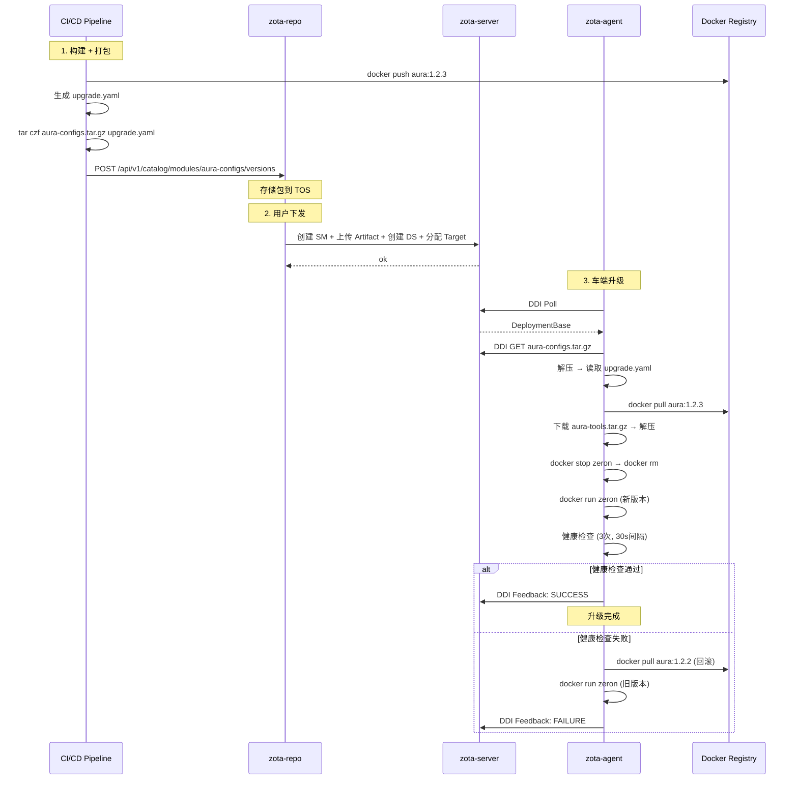

# aura-configs 升级流程设计

## 概述

通过 zota-repo 维护的 `upgrade.yaml` 清单，实现车端多模块（Docker 镜像 + 工具包）的统一升级。

## 包结构

```
aura-configs.tar.gz
└── upgrade.yaml         # 升级清单
```

### upgrade.yaml 格式

```yaml
# aura-configs upgrade manifest v1
version: "1.0"

# 产品上下文
product:
  id: "aura"

# 目标模块列表 (按顺序执行)
# 每个模块对应 zota-server 上一个独立的 SoftwareModule
# agent 通过 DDI 下载所有模块的 artifact
modules:
  # 模块 1: Docker 镜像 — agent 执行 docker pull
  - name: aura
    type: docker
    version: 1.2.3
    image: harbor.intra.zeron.ai/smartdrive/aura:1.2.3

  # 模块 2: 工具包 — agent 通过 DDI 下载 artifact
  - name: aura-tools
    type: file
    version: 1.2.3
    module_name: "aura-tools"       # zota-server 上的 SM 名称
    extract_to: "/opt/aura/tools/"

  # 模块 3: 模型包 — 同上，DDI 下载
  - name: aura-models
    type: file
    version: 1.2.3
    module_name: "aura-models"
    extract_to: "/opt/aura/models/"

# 健康检查
health_check:
  type: container
  container_name: zeron
  timeout_seconds: 30
  retries: 3

# 回滚策略 — agent 自动快照当前状态，失败时恢复
rollback:
  strategy: auto
```

### 下载模式：统一走 DDI

```
zota-repo                                    zota-server
    │                                             │
    │  ① 下发所有模块 (每个 module 创建一个 SM)      │
    │  ── aura-configs.tar.gz ────────────────→   │
    │  ── aura-tools.tar.gz   ────────────────→   │
    │  ── aura-models.tar.gz  ────────────────→   │
    │                                             │
    │                                    车端 agent
    │                                        │
    │                         ② DDI Poll ←─┘
    │                        ③ DDI GET artifacts (全部通过 DDI)
    │                        ④ 解压 → 按 YAML 顺序升级
    │                        ⑤ Feedback SUCCESS/FAILURE
```

**优势：agent 只需要 DDI 凭证，零额外配置。所有下载统一走 zota-server。**

## 完整流程图



## zota-agent 需要的改动

### 新增 upgrade.yaml 解析

```go
// internal/upgrader/manifest.go

type Manifest struct {
    Version     string          `yaml:"version"`
    Product     ProductSpec     `yaml:"product"`
    Modules     []ModuleSpec    `yaml:"modules"`
    HealthCheck HealthCheckSpec `yaml:"health_check"`
    Rollback    RollbackSpec    `yaml:"rollback"`
}

type RollbackSpec struct {
    Strategy string            `yaml:"strategy"` // auto | manual
    Manual   map[string]string `yaml:",inline"`  // 仅 manual 模式使用
}

type ModuleSpec struct {
    Name       string `yaml:"name"`
    Type       string `yaml:"type"`       // docker | file
    Version    string `yaml:"version"`
    Image      string `yaml:"image,omitempty"`
    ArtifactURL string `yaml:"artifact_url,omitempty"`
    SHA256     string `yaml:"sha256,omitempty"`
    ExtractTo  string `yaml:"extract_to,omitempty"`
}
```

### 新增升级编排

```go
// internal/upgrader/orchestrator.go

func (o *Orchestrator) ExecuteFromManifest(manifestPath string) error {
    manifest := parseManifest(manifestPath)

    // 0. Snapshot 当前状态（用于回滚）
    snapshot := o.snapshotCurrentState()
    defer func() {
        if recover() != nil || o.upgradeFailed {
            o.rollbackTo(snapshot)  // 恢复到升级前的确切状态
        }
    }()

    // 1. Pre-flight: 磁盘/电池/并发检查
    // 2. 按模块顺序执行
    for _, mod := range manifest.Modules {
        switch mod.Type {
        case "docker":
            pullImage(mod.Image)
        case "file":
            downloadAndExtract(mod.URL, mod.ExtractTo)
        }
    }
    // 3. Stop old → Start new
    // 4. Health check (retries with timeout)
    // 5. On failure → Rollback to snapshot
}
```

## 兼容性

| 场景 | 处理方式 |
|------|---------|
| **无 docker 的未来车型** | upgrade.yaml 中 type=file，agent 直接解压部署 |
| **多模块升级** | modules 数组按序执行，失败即停止 |
| **仅升级 tools** | modules 只包含 file 类型 |
| **仅升级镜像** | modules 只包含 docker 类型 |
| **离线环境** | artifact_url 指向 TOS，预下载到本地缓存 |

## 与现有 OTA 流程的关系

```
现有: zota-server Web UI → 上传 artifact → 创建 DS → 分配 target
新增: zota-repo → (自动) → zota-server → agent

两者共享同一 zota-server，互补:
- Web UI: 手动操作，适合开发调试
- zota-repo: 自动化下发，适合产线/运维
```

## 实施优先级

| 优先级 | 内容 | 依赖 |
|--------|------|------|
| P0 | zota-repo → zota-server 写通道 | zotaserver/client.go POST 方法 |
| P1 | zota-repo 下发 UI | P0 |
| P2 | zota-agent manifest 解析 + 编排 | P0 |
| P3 | CI/CD 自动打包 aura-configs.tar.gz | P0 |
