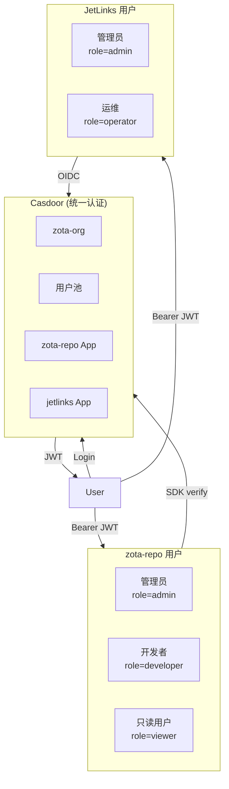

# Proposal: Casdoor OIDC 集成 — zota-repo + JetLinks

> 提案状态: Draft | 2026-07-19
> 关联: P0-3 auth 加固（临时方案已完成，此提案为永久方案）

---

## 1. 动机

### 当前问题
- zota-repo 所有 API 端点开放，仅靠可选 Bearer token 保护
- 无用户概念、无角色、无 RBAC
- JetLinks 使用独立认证体系，与 ZOTA 无交集
- 运维人员需要在两个系统分别管理账号

### 目标
1. **zota-repo**: 接入 Casdoor OIDC，JWT token 验证 + RBAC
2. **JetLinks**: 接入同一 Casdoor 实例，实现统一身份认证
3. **统一权限模型**: 一个 Casdoor 实例管理所有用户，不同应用分配不同角色

---

## 2. 架构



### 关键设计

| 决策 | 选择 | 理由 |
|------|------|------|
| 认证协议 | OIDC (OpenID Connect) | 标准协议，Casdoor 原生支持 |
| zota-repo 接入方式 | `casdoor-go-sdk` SDK | 直接 Go SDK 调用，无需额外 HTTP 封装 |
| JetLinks 接入方式 | Spring Security OIDC | Spring Boot 原生 OIDC 支持 |
| Token 格式 | JWT (RS256) | Casdoor 签发，zota-repo 用公钥验证 |
| 权限模型 | RBAC (role-based) | 符合最小权限原则 |

---

## 3. 涉及文件

### 3.1 zota-repo 变更

| 文件 | 变更 | 回滚方式 |
|------|------|---------|
| `go.mod` | 加 `casdoor-go-sdk` | `git revert` |
| `internal/api/middleware.go` | 新增 `casdoorMiddleware`，替换 `authMiddleware` | 切回 `ZOTA_API_TOKEN` 模式 |
| `internal/api/router.go` | 中间件链替换 | 同上 |
| `configs/config.example.yaml` | 新增 `auth:` 配置节 | 删配置行 |
| `internal/config/config.go` | 新增 AuthConfig 结构体 | 同上 |

### 3.2 JetLinks 变更

| 文件 | 变更 |
|------|------|
| `jetlinks-community/jetlinks-manager/.../application.yml` | 加 Spring Security OIDC 配置 |
| `jetlinks-community/.../SecurityConfig.java` | 加 OIDC 登录过滤器 |
| `jetlinks-community/.../UserMapper.java` | 映射 Casdoor 用户到 JetLinks 用户 |

### 3.3 新增文件

| 文件 | 用途 |
|------|------|
| `zota-repo/internal/auth/` | Casdoor OIDC 验证 + RBAC 中间件 |
| `deploy/casdoor/` | Casdoor K8s 部署 (ArgoCD) |

---

## 4. 配置设计

### zota-repo `config.yaml`

```yaml
auth:
  # mode: disable | token | casdoor
  #   disable  — 无认证（开发环境）
  #   token    — 现有 ZOTA_API_TOKEN Bearer 模式（过渡期）
  #   casdoor  — Casdoor OIDC JWT 验证
  mode: disable
  casdoor:
    endpoint: https://casdoor.intra.zeron.ai
    client_id: 9b8c7d6e5f4a3b2c1d0e
    client_secret: ""
    certificate: |-
      -----BEGIN CERTIFICATE-----
      ...
      -----END CERTIFICATE-----
    organization: zota-org
    application: zota-repo
```

### 三种模式共存

```
auth.mode=disable  → 全线开放（当前开发模式）
auth.mode=token    → ZOTA_API_TOKEN Bearer（临时方案，已实现）
auth.mode=casdoor  → Casdoor OIDC JWT 验证 + RBAC（目标）
```

### RBAC 角色设计

| 角色 | zota-repo 权限 | JetLinks 权限 |
|:----|:---------------|:--------------|
| `admin` | 全部 CRUD + 系统管理 | 全部权限 |
| `developer` | 版本 CRUD + 兼容性规则 | 设备管理 |
| `operator` | 只读 + Rollout 操作 | 运维操作 |
| `viewer` | 只读 Dashboard | 只读监控 |

在 zota-repo 侧实现 `RoleMiddleware`:

```go
// RoleMiddleware checks that the authenticated user has at least one of the
// required roles. Must be used after casdoorMiddleware.
func RoleMiddleware(roles ...string) func(http.Handler) http.Handler {
    return func(next http.Handler) http.Handler {
        return http.HandlerFunc(func(w http.ResponseWriter, r *http.Request) {
            user := auth.UserFromContext(r.Context())
            if user == nil {
                http.Error(w, `{"error":"unauthorized"}`, http.StatusUnauthorized)
                return
            }
            for _, role := range roles {
                if user.HasRole(role) {
                    next.ServeHTTP(w, r)
                    return
                }
            }
            http.Error(w, `{"error":"forbidden: insufficient role"}`, http.StatusForbidden)
        })
    }
}
```

---

## 5. 路由权限矩阵

| 路由 | 方法 | 所需角色 |
|:-----|:----:|:--------|
| `/health`, `/metrics` | GET | 公开 |
| `/api/v1/catalog/modules` | GET | viewer+ |
| `/api/v1/catalog/modules` | POST | developer+ |
| `/api/v1/catalog/modules/{module}/versions` | GET | viewer+ |
| `/api/v1/catalog/modules/{module}/versions` | POST | developer+ |
| `/api/v1/catalog/modules/{module}/versions/{v}/promote` | POST | operator+ |
| `/api/v1/catalog/modules/{module}/versions/{v}/revoke` | POST | admin |
| `/api/v1/compatibility/rules` | POST | developer+ |
| `/api/v1/compatibility/rules/{id}` | DELETE | admin |
| `/api/v1/inventory/vehicles` | GET | viewer+ |
| `/api/v1/inventory/vehicles` | POST | operator+ |
| `/api/v1/reconciliation/sync/{vin}` | POST | operator+ |
| `/api/v1/seed` | POST | admin |
| `/api/v1/compliance/certifications` | POST | admin |
| `/api/v1/stage-gates/evaluate` | POST | developer+ |
| `/api/v1/files/**` | 上传 | developer+ |
| `/api/v1/files/**` | 删除 | admin |

---

## 6. 实现计划

| 步骤 | 内容 | 估时 |
|:----|:-----|:----:|
| 1. Casdoor 部署 | K8s Deployment + ArgoCD + PostgreSQL | 1d |
| 2. Casdoor 配置 | 创建组织/应用/用户/角色 | 0.5d |
| 3. zota-repo SDK 集成 | `go.mod` + `internal/auth/` 包 + 中间件 | 1d |
| 4. zota-repo 路由权限 | 路由逐一标注角色 | 0.5d |
| 5. zota-repo 测试 | mock Casdoor 服务器的单元测试 | 1d |
| 6. JetLinks OIDC 集成 | Spring Security 配置 + 用户映射 | 1d |
| 7. 端到端验证 | 登录→JWT→API 调用→RBAC 验证 | 0.5d |

**总估时**: 5.5 天（可并行步骤 3+6）

---

## 7. 回滚方案

| 场景 | 回滚操作 |
|:----|:---------|
| Casdoor 服务宕机 | zota-repo 切 `auth.mode: token`，降级到 Bearer token |
| JWT 验证失败 | Casdoor 证书轮换后旧 token 自然过期 |
| RBAC 配置错误 | 修复 Casdoor 角色配置，无需改代码 |
| 完全回退 | `git revert` + 切 `auth.mode: disable` |
