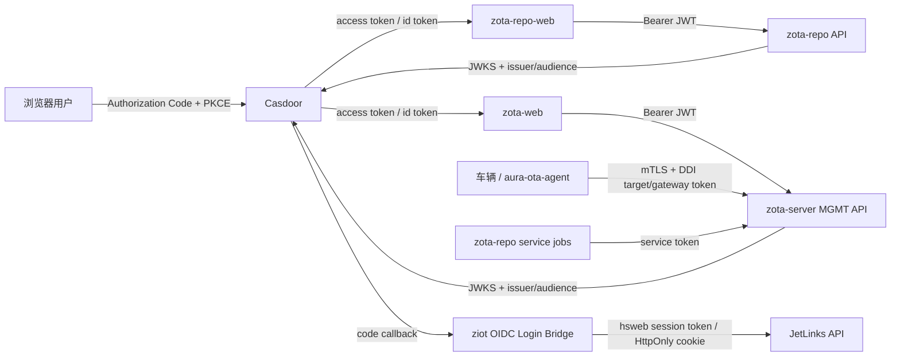

# Casdoor SSO 统一改造分析

> 分析日期：2026-08-03
> 状态：分析结论，尚未实施业务代码
> 适用范围：zota-repo、zota-server（当前工作区对应 HawkBit）、ziot（当前工作区对应 JetLinks）
> Authing 与统一 UI 的扩展方案见 `zota-unified-identity-ui-analysis.md`。

## 1. 结论

**可以使用 Casdoor 为三套系统提供统一登录（SSO）和统一身份源。** 推荐将 Casdoor 定位为 OIDC Identity Provider，各业务后端分别作为 Resource Server；不要让三个后端共享数据库用户表，也不要把一个应用的 client secret 放进浏览器。

SSO 的边界必须明确：

- 人员登录、用户信息、角色/权限：统一由 Casdoor 管理。
- 车辆 DDI、设备证书、网关 token、服务间调用：继续使用现有 mTLS、Gateway Token 和服务 token，不改成用户 SSO。
- `zeol` 是离线优先的产线工具，现有 PIN + 本地会话 + 审计模型应继续保留，不纳入云端 SSO 强依赖。

当前已有一部分实现，但现有 `.github/skills/zota/references/casdoor-integration-proposal.md` 是 2026-07-19 的历史草案，里面“zota-repo 尚未接入”和“JetLinks 使用 Spring Security”的描述已经不符合代码现状。本文件作为后续实施的基线。

### 1.1 Authing 兼容边界

后续实现应使用 provider-neutral OIDC 配置和 claim adapter，而不是继续扩大 Casdoor SDK/URL 的使用范围。Casdoor 与 Authing 均通过 issuer discovery、JWKS、audience 和标准 code flow 接入；一个环境优先只信任一个 issuer。若必须在同一登录页同时提供两者，优先使用身份 broker 或 BFF 收敛为一个下游 issuer，避免三个业务后端分别维护多 issuer 验证器。

## 2. 工作区项目映射与现状

工作区没有名为 `zota-server`、`ziot` 的目录，按现有 ZOTA 文档和代码作如下映射：

| 逻辑项目 | 工作区目录 | 当前技术栈 | 当前人员认证 | 结论 |
|---|---|---|---|---|
| zota-repo | `zota-repo/` + `zota-repo-web/` | Go API；React 19 + Ant Design 6 SPA | Go 后端已有 `disable/token/casdoor` 三种模式；前端已手写 Casdoor OAuth code exchange | 后端已有基础能力，前后端仍需安全加固和统一封装 |
| zota-server | `hawkbit/` + `hawkbit-updater-ui/` | Spring Boot/HawkBit；React 19 + Ant Design 6 SPA | 后端默认 Basic，代码已支持 OAuth2 Resource Server；前端保存 Basic 凭据并发送 `Authorization: Basic` | 后端可直接启用 Casdoor JWT，前端需要完整替换登录链路 |
| ziot | `jetlinks-community/` | Spring WebFlux + hsweb v5 | hsweb 本地用户、Redis session token、API Key、注解/事件授权 | 不能按 Spring Security 方案接入；推荐 OIDC 登录桥接到 hsweb 本地会话 |
| Casdoor | `casdoor/` | Go + Casbin；OIDC/OAuth2/JWKS | 统一用户、组织、应用、角色和外部 IdP | 可作为统一 IdP，需先固定 claim 和密钥轮换约定 |

### 2.1 zota-repo

- `zota-repo/internal/auth/` 已使用 `casdoor-go-sdk` 校验 JWT，并将 Casdoor 角色映射为 `admin/developer/operator/viewer`。
- `zota-repo/internal/api/router.go` 已大量使用 `RequireRole`，读操作默认 viewer，写操作按 developer/operator/admin 分层。
- `zota-repo-web/src/auth/` 已实现登录跳转、state 校验、code 换 token、401 重定向；`src/api/client.ts` 会附加 Bearer token。
- 当前前端配置把 Casdoor endpoint、client id、**client secret** 和回调地址写在源码中，并把 access token 放在 `localStorage`。SPA 中的 client secret 不具备保密性，必须撤销并轮换。
- 后端 SDK 的 `ParseJwtToken` 会校验签名和标准时间字段，但不会替应用显式约束 `iss`、`aud`；生产方案需要补上 issuer/audience 校验，或改为带缓存和轮换能力的 JWKS 校验器。
- Casdoor SDK 的非标准 JWT `roles` 结构是角色对象数组，不能假设所有资源服务器都收到 `string[]`。需要在统一 claim adapter 中兼容字符串、角色对象和 groups。

### 2.2 zota-server / HawkBit

- `hawkbit-mgmt-starter` 已提供 OAuth2 Resource Server 开关：`hawkbit.server.security.oauth2.resourceserver.enabled`。
- 资源服务器使用 Spring Security JWT decoder；`spring.security.oauth2.resourceserver.jwt.issuer-uri` 或 `jwk-set-uri` 可指向 Casdoor。
- HawkBit 的授权不是简单的 `admin/operator` 两级角色，而是 `READ_TARGET`、`CREATE_DISTRIBUTION_SET`、`HANDLE_ROLLOUT` 等细粒度 authority。Casdoor 的角色只能作为输入，必须在适配器中映射为 HawkBit permission。
- 当前实现从 JWT 的 `roles` claim 读取 `Collection<String>`，并将其直接转成 authority；Casdoor role object 或 `groups` claim 会导致映射失败，必须改为可配置的 claim normalizer。
- 当前默认 tenant 是 `DEFAULT`。第一阶段应固定 `tenant=DEFAULT`，不要在没有租户隔离设计前把 Casdoor organization 直接映射成 HawkBit tenant。
- DDI、artifact download 和 MGMT API 使用的是不同安全边界。Casdoor 只替换管理端人员认证，不能替换车端 target token/gateway token。
- `hawkbit-updater-ui` 的 SockJS/STOMP 客户端没有可靠地设置浏览器 WebSocket 握手的 Authorization header。启用 JWT 后，必须单独设计 STOMP CONNECT token、反向代理会话或保留 polling fallback，不能假设 REST token 会自动保护 WebSocket。

### 2.3 ziot / JetLinks

- `jetlinks-community` 使用 hsweb v5 的响应式授权链，不是 Spring Security；认证解析由 `ReactiveUserTokenParser`、`UserTokenWebFilter`、`ReactiveAuthenticationSupplier` 等组件组成。
- 已存在 `ThirdPartyUserBindEntity/Service/Controller`，可以记录 `type=oidc`、`provider=casdoor` 与 Casdoor `sub` 的绑定关系。
- 已存在 Redis `UserTokenManager`、本地用户/角色/权限服务和 API Key 支持，继续复用这些能力比替换整个 hsweb 认证链风险更低。
- `zeron-cloud-web` 是与 `jetlinks-community` 配套的真实 ziot 前端（Vue 3 + TypeScript + Vite + Pinia + JetLinks web 包），当前工作区分支为 `master`，认证和权限入口均已定位，详见 `ziot-casdoor-web-analysis.md`。
- 前端当前把本地登录返回的 token 写入 `localStorage` 的 `X-Access-Token`，路由守卫凭 token 调用 `/user/detail`，再请求服务端菜单并生成动态路由；按钮权限使用 `menuCode:buttonCode`。Casdoor 不需要替换这套菜单/按钮权限模型。
- `App.vue` 还支持从 URL `?token=` 写入 token，部分下载、WebSocket 和子应用跳转会把 token 放入 URL；接入 Casdoor 时这些入口必须纳入统一 session client，禁止继续扩散 URL token。
- 推荐新增 OIDC 登录桥：后端完成 code 换 token、校验和本地用户绑定，成功后签发 hsweb 会话；前端保留现有 `/authorize/me`、菜单、按钮权限和业务 API，仅替换登录页、回调、401/登出处理。直接让 Casdoor JWT 进入 hsweb Bearer parser 作为第二阶段方案。

## 3. 推荐目标架构



推荐分层：

1. **zota-repo-web、zota-web**：浏览器作为 OIDC public client，使用 Authorization Code + PKCE；access token 只保存在内存，refresh token 采用轮换策略。若平台允许增加 BFF，优先改为 BFF + HttpOnly Secure SameSite cookie，可进一步降低 XSS 取 token 风险。
2. **zota-repo API、zota-server MGMT API**：只接受 Casdoor access token，验证签名、`iss`、`aud`、`exp`、`nbf`、token type，并执行本项目自己的权限模型。
3. **JetLinks**：第一阶段使用服务端 OIDC code callback，把 Casdoor 用户映射到 hsweb 用户和权限后签发现有 hsweb session token。这样前端只需改登录入口，不需要重写 hsweb 的所有权限注解和事件。
4. **统一前端认证包**：抽取一个内部 `@zota/auth`（或独立 npm workspace package），只封装 OIDC discovery、PKCE、state/nonce、token memory、refresh、logout、user/role claims、401/403 行为；业务项目不再各自手写 OAuth URL 和 token exchange。

## 4. Casdoor 侧配置基线

### 4.1 应用

建议在同一 organization 下创建三个应用（名称可按部署域名调整）：

| 应用 | 客户端类型 | 允许回调 | 用途 |
|---|---|---|---|
| `zota-repo-web` | public SPA，Authorization Code + PKCE(S256) | 每个环境的 `/callback` | zota-repo 管理 UI |
| `zota-web` | public SPA，Authorization Code + PKCE(S256) | 每个环境的 `/callback` | zota-server 管理 UI |
| `ziot-web` | confidential server client | 仅后端 callback | JetLinks OIDC 登录桥 |

不要把 `client_secret` 编译进任何 SPA。前端只使用 client id；secret 只放在 JetLinks/zota BFF 的 Secret 中。

### 4.2 统一 claim 合约

所有后端至少校验：

| claim | 约束 |
|---|---|
| `iss` | 精确匹配 Casdoor issuer，禁止只校验域名 |
| `aud` | 精确匹配本资源服务器约定的 audience；不要接受任意 client id |
| `sub` | 作为跨系统稳定用户主键；禁止用 email 作为主键 |
| `exp`、`nbf`、`iat` | 校验时钟偏差，建议最大 60 秒 |
| `nonce` | 仅由 OIDC client 在回调时校验 |
| `preferred_username`、`name`、`email` | 展示和首次建档使用，不能作为唯一身份 |
| `groups` / `roles` | 由应用适配器转换，不能直接当作跨系统权限 |

建议使用 `groups` 作为稳定的字符串分组，或由 Casdoor 应用配置输出明确的字符串 role claim。后端必须兼容 Casdoor 当前 JWT 中可能出现的角色对象数组，并统一转换为内部角色集合。

### 4.3 角色与权限

Casdoor 角色是跨应用身份属性，业务权限由各资源服务器映射：

| Casdoor role/group | zota-repo | zota-server | ziot |
|---|---|---|---|
| `zota-admin` | `admin` | 全部 HawkBit permissions | hsweb 管理员权限 |
| `zota-release` | `developer` + 发布/审批所需权限 | `CREATE/UPDATE_*`、`HANDLE_ROLLOUT` 等 | 按需配置 |
| `zota-operator` | `operator` | `READ_*`、部署和 rollout 操作权限 | 运维权限 |
| `zota-viewer` | `viewer` | 只读 permissions | 只读权限 |

不建议使用 Casdoor 的 `isAdmin` 直接授予三个系统的超级权限；每个系统都必须有显式 allow-list 映射和默认 deny。

## 5. 各后端改造方案

### 5.1 zota-repo（低到中等改造量）

保留现有 `auth.mode=disable|token|casdoor` 作为迁移开关，但生产默认只允许 `casdoor`：

- 增加 `issuer`、`audience`、JWKS 地址和 clock skew 配置；优先 JWKS 自动发现，支持 Casdoor key rotation。
- 在现有 `Authenticator` 中拒绝 refresh token、错误 issuer、错误 audience、未知签名算法和空 subject。
- 将 service-to-service `ZOTA_API_TOKEN` 与人员 JWT 分开命名、分开权限和网络入口；不要把静态服务 token 自动映射为全局 admin。
- 增加 `GET /api/v1/me`，返回稳定 user id、display name、email、roles 和权限摘要，前端只从此接口获得业务权限，不在浏览器自行猜角色。
- 保持 router 的 `RequireRole`，补充未覆盖路由的权限测试，确保新增路由默认拒绝而不是默认放行。
- 从 `zota-repo-web/src/auth/config.ts` 移除 hard-coded client secret；撤销旧 secret 并通过部署环境变量注入 Casdoor endpoint/client id/redirect URI。

### 5.2 zota-server / HawkBit（中等改造量）

- 开启 `hawkbit.server.security.oauth2.resourceserver.enabled=true`。
- 配置 `spring.security.oauth2.resourceserver.jwt.issuer-uri`（或受控的 `jwk-set-uri`），并为每个环境限制 audience。
- 生产关闭 Basic fallback：`hawkbit.server.security.allowHttpBasicOnOAuthEnabled=false`；保留 Basic 只用于受控迁移窗口或服务端运维，不暴露给公网。
- 扩展 `MgmtSecurityConfiguration` 的 JWT converter：支持字符串 roles、Casdoor role object、groups，并通过配置映射为 HawkBit 的细粒度 `SpPermission`。
- 固定 `DEFAULT` tenant，直到多租户映射、数据隔离和审计模型完成设计。
- `hawkbit-updater-ui` 删除用户名/密码表单和 Basic token 持久化，改用统一 `@zota/auth`。
- REST 401 统一触发登录，403 保留在当前页面并显示无权限状态；不要把 403 当作重新登录。
- 为 WebSocket 选择一种明确方案：STOMP CONNECT header 中携带短期 access token并在服务端握手拦截，或通过同源 BFF cookie 认证。未完成前保留 polling fallback，并在 UI 中显示实时通道不可用状态。

### 5.3 ziot / JetLinks（中等到较高改造量）

推荐第一阶段做“OIDC 登录桥”，而不是直接把 Casdoor JWT 塞进 hsweb 默认 Bearer parser：

1. 新增 `GET /authorize/casdoor`，由 JetLinks 后端生成 state、nonce、PKCE 并重定向 Casdoor。
2. 新增 callback，后端用 confidential client secret 换 code，校验 issuer/audience/nonce/signature。
3. 用 Casdoor `sub` 查询或创建本地 `UserEntity`，写入 `ThirdPartyUserBindEntity(type=oidc, provider=casdoor, thirdPartyUserId=sub)`。
4. 将 Casdoor group/role 映射为 hsweb 本地角色、维度和权限，默认 deny；用户被禁用或 Casdoor 标记 forbidden 时拒绝登录。
5. 复用现有 `UserTokenManager` 签发 hsweb session token，或者通过 HttpOnly Secure SameSite cookie 建立会话；前端只需使用现有 `/authorize/me` 和 API 调用方式。
6. 登出时同时清理本地会话，并跳转 Casdoor end-session endpoint；不删除 Casdoor 用户绑定记录。

只有在确实需要完全无状态 API 时，才实现 `CasdoorReactiveUserTokenParser + ReactiveAuthenticationSupplier`。该方案要处理 hsweb 默认 `BearerTokenParser` 的解析优先级、JWKS 缓存、用户建档、权限装载和 token 撤销，风险高于登录桥，不作为第一阶段方案。

## 6. 统一前端改造方案

### 6.1 统一认证生命周期

三套前端统一以下状态机：

```text
BOOTSTRAP -> RESTORE_SESSION -> AUTHENTICATED
                         ├── no session -> REDIRECT_TO_CASDOOR
                         ├── expired -> REFRESH -> AUTHENTICATED
                         └── refresh failed -> LOGGED_OUT
```

统一模块至少提供：

- `login(returnTo)`、`handleCallback()`、`logout()`、`getAccessToken()`、`getUser()`。
- state + nonce + PKCE 校验，回调错误和超时状态。
- access token 内存存储；不得把 client secret、密码或 Basic credential 写入 localStorage。
- `fetch/axios` request interceptor 自动附加 Bearer；单飞 refresh，避免并发 401 触发多个刷新请求。
- 401 清理会话并回 Casdoor；403 显示无权限页；网络错误不清理会话。
- 跨标签页 logout 通知（BroadcastChannel 或受控 storage event），避免一个应用退出后其他应用仍显示已登录。

### 6.2 页面和权限

- 后端 `/me` 是权限唯一来源；前端只做体验层隐藏，后端始终做最终鉴权。
- 统一 `can(permission)` / `hasRole(role)`，路由和菜单项声明所需权限，不再用 `username === 'admin'` 判断角色。
- zota-repo 的 `filterVisibleNav`、HawkBit 的 `role === 'Admin'` 都改成 permission-based policy。
- 所有写按钮同时覆盖 loading、401、403、网络失败和重复提交；无权限页面不能仅靠隐藏菜单实现安全。
- 统一用户菜单：显示 Casdoor display name/avatar/email，提供“退出当前应用”和“退出全部应用”语义；退出全部应用调用 Casdoor end-session。
- 统一登录、回调、会话过期、无权限、服务不可用页面的中英文 i18n key。

### 6.3 WebSocket 与下载

- WebSocket 认证不能复用普通 Axios header 的假设，单独完成握手/CONNECT token 设计。
- 文件预览和下载请求必须经过同一 token client；禁止组件直接从 localStorage 读取 token。
- 反向代理保持同源 `/api`、`/rest`、`/ws`，避免浏览器 CORS 和 token 泄露到多个域名。

### 6.4 建议目录

```text
packages/zota-auth/
  src/oidcClient.ts       # discovery, PKCE, callback, logout
  src/sessionStore.ts     # memory session + refresh single-flight
  src/httpInterceptors.ts # axios/fetch 401/403 behavior
  src/permissions.ts      # normalized user and can()
  src/react.tsx           # AuthProvider, AuthGuard, useAuth
apps/zota-repo-web/       # 只声明路由和业务权限
apps/zota-web/            # 只声明路由和 HawkBit permission
apps/ziot-web/            # 对接 JetLinks bridge
```

如果三个前端暂时不能合并为 monorepo，也应保持同一 `@zota/auth` 接口和同一 OIDC 配置 schema，避免继续复制两套 OAuth 实现。

## 7. 分阶段实施与验收

### Phase 0：安全和契约（阻塞项）

- 撤销并轮换已提交到源码/示例配置的 Casdoor client secret、数据库密码、对象存储密钥和其他敏感凭据。
- 定义 issuer、audience、redirect URI、claim、角色到业务权限的契约。
- 为 Casdoor 配置三套应用和 staging/prod 分离的回调地址。

### Phase 1：zota-repo + zota-web

- zota-repo backend 增加 issuer/audience/JWKS 校验和 `/me`。
- 两个 React SPA 接入共享 auth 模块，移除 Basic/硬编码 secret/localStorage token。
- HawkBit MGMT API 先在 staging 开启 JWT，保留受控 Basic 回退；确认 REST、下载和 WebSocket/polling 行为。

### Phase 2：JetLinks OIDC 登录桥

- 实现 callback、用户绑定、角色/权限同步、会话签发和注销。
- 在实际 ziot UI 中替换登录页和 401 处理；本地用户名密码可保留为 break-glass 管理入口，但必须限制网络和审计。

### Phase 3：收敛与加固

- 关闭生产 `disable`、静态 Basic 和明文密码登录（按 break-glass 规则保留最小应急入口）。
- 启用 JWKS 缓存和密钥轮换演练，接入审计、指标和告警。
- 完成跨应用登出、权限变更即时生效策略和 WebSocket JWT 端到端测试。

### 验收矩阵

| 场景 | 期望 |
|---|---|
| Casdoor 登录后打开三个 UI | 不再输入第二次密码，分别获得本应用权限 |
| token 的 `iss`/`aud` 错误 | 三个后端均返回 401 |
| access token 过期 | 仅执行一次 refresh；refresh 失败后回登录 |
| viewer 调用写接口 | 后端返回 403，前端显示无权限状态 |
| Casdoor 禁用用户 | 新登录失败；已有短 token 到期后不能继续访问 |
| Casdoor 密钥轮换 | JWKS 更新后新旧允许窗口行为符合约定，无需重启服务 |
| 车辆 DDI 请求 | 不受人员 SSO 改造影响，继续使用 mTLS/target/gateway token |
| WebSocket 不可用 | UI 自动降级 polling，并清楚显示实时通道状态 |

## 8. 风险清单

| 级别 | 风险 | 处理 |
|---|---|---|
| 阻塞 | SPA 源码中存在 client secret | 立即撤销/轮换；只使用 public client + PKCE |
| 阻塞 | 当前 zota-repo 只校验签名和时间，未显式限制 issuer/audience | 增加校验并补测试 |
| 高 | Casdoor roles 结构与 HawkBit `Collection<String>` 不一致 | 统一 claim normalizer 和权限映射 |
| 高 | JetLinks 不是 Spring Security | 使用 hsweb OIDC 登录桥，避免照搬旧草案 |
| 高 | WebSocket 无浏览器 Authorization header | 单独设计 CONNECT/代理会话，保留 polling fallback |
| 中 | Basic 与 JWT 双认证并存造成权限绕过 | 迁移窗口后关闭 Basic；服务 token 使用独立入口 |
| 中 | 前端自行隐藏菜单被误认为安全控制 | 所有 API 继续后端鉴权，前端仅改善体验 |
| 中 | Casdoor 不可用或 JWKS 暂时不可达 | JWKS 缓存、短期 token、健康检查和明确 fail-closed 策略 |

## 9. 与旧文档的关系

- 本文件取代 `casdoor-integration-proposal.md` 中“zota-repo 尚未接入”和“JetLinks 使用 Spring Security”的现状判断。
- `jetlinks-casdoor-integration.md` 可作为 hsweb 组件调查记录，但其中“直接实现自定义 parser”为备选方案，不是第一阶段推荐方案。
- `.github/skills/zota/SKILL.md` 中关于 zota-repo Casdoor 的“规划中”描述，应在开始实施后更新为分阶段状态。
