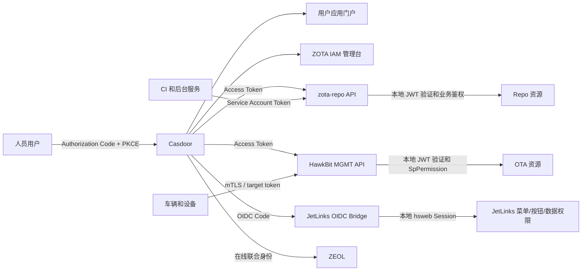

# ZOTA IAM v1 架构基线

> 决策日期：2026-08-08
> 状态：目标架构已确认；ZOTA Repo 首批接入已实现，待生产联调
> 范围：Casdoor、zota-repo、zota-repo-web、HawkBit、hawkbit-updater-ui、JetLinks、zeron-cloud-web、ZEOL 及运维入口
> 关联分析：`casdoor-sso-unified-analysis.md`、`casdoor-integration-proposal.md`、`zota-unified-identity-ui-analysis.md`、`ziot-casdoor-web-analysis.md`

## 1. 决策摘要

ZOTA IAM v1 是 ZOTA 全平台的统一身份与访问治理方案，不是一个必须独立部署的新业务系统。

v1 采用演进式架构：

- Casdoor 是统一 OIDC Identity Provider，负责人员目录、登录、MFA、会话、应用准入和授权来源。
- ZOTA IAM 管理台是统一管理体验，第一阶段直接在 Casdoor Web 中以 ZOTA product mode 实现。
- 各业务后端是 Resource Server，负责 JWT 验证、业务权限、数据范围和资源状态约束。
- HawkBit 和 JetLinks 保留已有的细粒度权限模型，不将全部授权判断迁入 Casdoor。
- 人员、服务和设备身份严格分离。
- ZEOL 保留离线 PIN 和本地会话，在线时联合 Casdoor，不建立云端 IAM 强依赖。
- 普通 API 请求本地验证 JWT，不在线调用 Casdoor Enforce。

该方案是当前代码基础上的推荐 v1，不代表未来永远不引入 OPA、Cerbos、OpenFGA 或独立 IAM 控制面。

### 1.1 当前实施状态

截至 2026-08-08，`zota-repo`、`zota-repo-web` 和 Casdoor 的 Repo 接入基线已经落地：

- `zota-repo` 本地验证 Casdoor 签名 JWT，严格校验 `iss`、`aud`、`azp`、`exp`、`nbf`、`sub` 和 `tokenType=access-token`。
- `zota-repo` 规范化 Repo 角色和权限；拒绝未知 `repo-*` 角色与未知 `repo.*` 权限，忽略其他应用命名空间的角色和权限。
- `zota-repo` 新增 `GET /api/v1/me`，返回当前用户的有效角色与权限。
- `ZOTA_API_TOKEN` 默认映射为 `operator`，不再隐式获得全局管理员权限，并可通过 `service_token_role` 配置。
- `zota-repo-web` 使用 Authorization Code + PKCE S256，不再在浏览器中保存 client secret。
- Web access token 仅保存在内存，`sessionStorage` 只保存短期 `state`、`nonce` 和 PKCE verifier。
- Web 使用 `/api/v1/me` 建立登录态，并按有效权限过滤已启用导航。
- 生产环境已经关闭 `VITE_AUTH_DISABLED`，前后端使用相同的 resource/audience。
- Casdoor 新增 `deployment/zota-iam/zota-repo.init-data.json` 声明式基线，包含 public client、四个 Repo 角色和权限目录。
- `zota-repo` 生产 Kustomize overlay 已配置 Casdoor 模式，并强制要求 client ID 与签名公钥 Secret。

当前代码完成不等于生产接入完成。上线前仍需安全导入 Casdoor 基线、分配用户角色、导出匹配的签名公钥、填充 Kubernetes Secret、部署前后端，并执行真实浏览器端到端登录和权限回收验证。

## 2. ZOTA IAM v1 是否是独立项目

### 2.1 v1 的项目形态

v1 首先是一个跨仓库架构项目和交付计划，不创建新的运行时服务：

| 责任 | v1 所在位置 |
|---|---|
| 身份、OIDC、MFA、会话、应用准入 | `casdoor/` |
| ZOTA 用户门户和 IAM 管理 UI | `casdoor/web/` 的 ZOTA product mode |
| IAM 声明式配置与权限目录 | 版本化配置目录和初始化/对账 Job |
| Repo 最终鉴权 | `zota-repo/` |
| OTA 最终鉴权 | `hawkbit/` |
| JetLinks 用户绑定和本地授权 | `jetlinks-community/` |
| 前端登录、权限体验 | 各前端及共享 OIDC/auth 包 |
| ZEOL 在线联合与离线降级 | `zeol/` |
| 登录、授权和业务操作审计 | Casdoor 与各业务系统共同产生日志，监控平台汇总 |

因此，`ZOTA IAM` 不等同于 Casdoor，也不应在 v1 被实现成另一个重复保存用户、角色和密码的系统。

### 2.2 何时拆出独立控制面

只有出现以下需求时，再评估独立的 `zota-iam-control-plane`：

- 一次授权需要同步 Casdoor、HawkBit、JetLinks 等多个系统。
- 需要临时授权、到期回收、代理授权或多级审批。
- 需要统一回答跨应用、跨资源的访问关系查询。
- Casdoor 原生 Role/Permission 无法表达复杂 ABAC 或关系权限。
- 需要可靠的授权事件、补偿任务、漂移检测和集中审计。

即使拆出控制面，它也只负责编排、策略和对账，不重新实现 OIDC 登录或保存用户密码。

## 3. 目标架构



## 4. 身份边界

| 身份 | 认证机制 | 禁止事项 |
|---|---|---|
| 人员 | Casdoor OIDC、MFA、短期会话 | 使用设备 token 或共享管理员账号 |
| 服务 | 独立 service account、最小权限 token | 把静态 API token映射为全局 admin |
| 设备 | mTLS、设备证书、target/gateway token | 将车辆接入人员 SSO |
| ZEOL 离线操作员 | 本地 PIN、SQLite 会话和审计 | 断网时自动提升角色 |

## 5. 应用与 Resource 注册

按用户可理解的产品入口注册，不按 Deployment 数量注册：

| 产品入口 | OIDC Client | Resource/Audience |
|---|---|---|
| 软件与制品中心 | `zota-repo-web`，public + PKCE | `https://zota-repo.intra.zeron.ai/api` |
| OTA 运营中心 | `hawkbit-updater-ui`，public + PKCE | `hawkbit-management-api` |
| 车辆与物联网中心 | `zeron-cloud-web` | JetLinks OIDC bridge |
| ZEOL 在线模式 | confidential/BFF client | 按实际调用 API 配置 |
| 运维平台 | ArgoCD、Argo Workflows、Grafana、Harbor 分别注册 | 各自 API |

DDI、车辆 Agent、Prometheus scrape endpoint 和后台队列不注册为人员应用。

## 6. Claim 契约

业务系统只依赖稳定、规范化的字符串 claim，不依赖 Casdoor 内部 Role 或 Permission 对象：

```json
{
  "sub": "stable-user-id",
  "iss": "https://casdoor.intra.zeron.ai",
  "aud": "https://zota-repo.intra.zeron.ai/api",
  "azp": "zota-repo-web",
  "zota_org": "zsd",
  "zota_roles": ["repo-developer"],
  "zota_permissions": ["repo.module.read", "repo.version.create"],
  "zota_scopes": ["fleet:heavy-truck", "env:prod"]
}
```

所有 Resource Server 必须验证签名、`iss`、`aud`、`azp`、`exp`、`nbf` 和非空 `sub`。业务系统自身命名空间中的未知角色、权限、scope 或 claim 类型默认拒绝；其他应用命名空间的声明应忽略，不能影响本应用授权。

## 7. 权限模型

统一权限语义，但不要求所有系统使用同一个权限数据库：

1. 平台角色：`platform-admin`、`security-admin`、`auditor`。
2. 应用角色：`repo-developer`、`ota-operator`、`ziot-viewer` 等。
3. 数据范围：tenant、project、fleet、vehicle group、environment、factory、station。
4. 业务约束：资源所有权、发布状态、审批状态、车辆状态等，由业务后端判断。

Casdoor Application Permission 用于应用可见性和准入，不替代业务 API 权限。前端隐藏菜单和按钮只改善体验，后端始终执行最终鉴权。

## 8. Casdoor 产品化边界

Casdoor UI 拆成两个体验面：

### 用户门户

- 我的应用
- 个人资料
- 密码、MFA、Passkey
- 会话与设备
- 最近登录和安全事件

### ZOTA IAM 管理台

- 人员与团队
- 应用与入口
- 角色模板
- 权限矩阵
- 数据范围
- 授权审批
- 访问审计
- 安全策略

短期使用 organization 的 `navItems/userNavItems` 收敛菜单。中期增加明确的 ZOTA product mode 或构建级 feature flag，移除 LLM、MCP、支付、购物车等无关导航和路由。普通用户应用列表必须由服务端 `GetAllowedApplications` 过滤，不能只靠前端隐藏。

## 9. 各系统实施边界

| 系统 | v1 主要工作 |
|---|---|
| zota-repo | 严格校验 issuer/audience/azp；使用字符串权限；未知角色默认拒绝；服务 token 最小权限 |
| zota-repo-web | 移除浏览器 client secret；启用 PKCE；生产禁止 auth disabled；按真实 permission 控制体验 |
| HawkBit | 启用 OAuth2 Resource Server；映射 Casdoor claim 到现有 `SpPermission`；DDI 保持独立 |
| hawkbit-updater-ui | Basic 改为 OIDC/Bearer；使用 `/userinfo.permissions`；单独处理 WebSocket 认证 |
| JetLinks | 新增 OIDC 登录桥，以 Casdoor `sub` 绑定本地用户；保留 hsweb 角色、菜单、按钮和数据权限 |
| zeron-cloud-web | 替换登录入口；禁止 URL、iframe 和 WebSocket 传播通用 bearer token |
| ZEOL | 加固 state、nonce、PKCE 和 JWT 验证；保留离线 PIN；明确离线权限降级 |
| 运维入口 | ArgoCD、Workflows、Grafana、Harbor 等使用独立 client、短会话和明确 RBAC |

## 10. 声明式 IAM

IAM 配置需要进入版本控制，并通过幂等 Job 初始化和持续对账：

```text
iam/
├── organizations.yaml
├── applications.yaml
├── resources.yaml
├── roles.yaml
├── permissions.yaml
├── role-bindings.yaml
└── permission-catalog.yaml
```

对账过程必须记录新增、修改、删除、冲突和漂移；生产环境同时补齐固定镜像版本、HA/PDB、数据库备份、Secret 管理、监控和审计。

## 11. 实施路线

### Phase 0：安全基线与 IAM 契约

- 固定 issuer、audience、claim、权限命名和 scope 语义。
- 清除 SPA client secret、URL token 和生产 auth-disabled。
- Web Client 全部采用 Authorization Code + PKCE。
- 后端完成严格 JWT 验证和默认拒绝。

### Phase 1：Casdoor 平台

- 收敛用户门户与 IAM 管理台。
- 建立应用目录、角色模板、权限目录。
- 实现声明式 bootstrap 和差异对账。
- 建立 MFA、会话、安全审计和 break-glass 策略。

### Phase 2：HawkBit

- 启用 Resource Server。
- Updater UI 切换 OIDC/Bearer。
- 使用现有 `SpPermission` 驱动前后端。
- 保持 DDI 和人员认证隔离。

### Phase 3：ZOTA Repo

- 已完成后端规范 claim、严格 JWT 校验和 `/api/v1/me`。
- 已完成 Web PKCE、内存 token 和权限导航基线。
- 已完成 Casdoor 声明式 client、角色、权限目录基线。
- 待完成生产 Casdoor 数据导入、用户角色分配、证书 Secret 和真实端到端联调。
- 后续继续细化页面按钮权限，并将 CI/service account 从人员角色中完全拆分。

Repo 被选作首个接入样板，因此实际实施顺序早于完整 Casdoor 管理台产品化和 HawkBit 改造；该调整不改变总体架构边界。

### Phase 4：JetLinks、ZEOL 和运维入口

- 实现 JetLinks OIDC bridge 和本地用户绑定。
- 清理 URL、iframe、WebSocket token。
- 加固 ZEOL 在线 SSO 和离线降级。
- 迁移 ArgoCD、Argo Workflows、Grafana、Harbor 等。

## 12. v1 验收标准

- 登录一次可无感进入已授权的多个 ZOTA 人员应用。
- 未获 Application Allow 的普通用户无法看到或进入应用。
- 每个 API 都拒绝错误 issuer、错误 audience、过期 token 和未知权限。
- 人员 token 不能调用 DDI；设备 token 不能调用人员管理 API。
- 权限收回能在约定时间内生效并留下审计记录。
- JetLinks 菜单、按钮、组织和数据权限在 SSO 迁移后保持一致。
- ZEOL 断网可继续执行被允许的本地流程，但不会获得更高权限。
- Casdoor 暂时不可用时，已签发且未过期 token 的普通 API 调用按策略继续工作。
- 所有旧认证通道都有关闭日期、使用告警和可审计的 break-glass 流程。

## 13. 后续演进条件

v1 完成后，根据真实复杂度再决定：

- 仅需统一策略表达：评估 OPA 或 Cerbos。
- 需要资源关系权限查询：评估 OpenFGA 或 SpiceDB。
- 需要跨系统审批、临时授权和一致性对账：建设独立 `zota-iam-control-plane`。

在没有上述明确需求和规模证据前，不增加新的 IAM 运行时服务。
