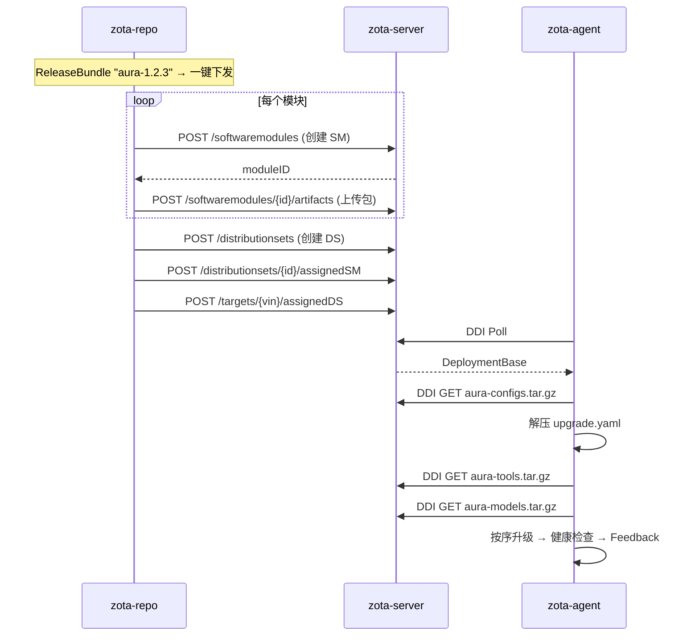

# zota-repo → zota-server 包下发通道设计

## 当前状态

### 存储层：共享 TOS Bucket
```
zota-repo (TOS Backend)          zota-server (S3ArtifactStorage)
         │                                  │
         └──── zota-repo bucket (同一 bucket, 同一凭证) ────┘
              endpoint: tos-s3-cn-shanghai.ivolces.com
              
zota-repo key: 自由路径 (versions/module/version/file.tar.gz)
zota-server key: DEFAULT/{sha1hash} (content-addressed)
```

**关键：同一 bucket 同一凭证，物理上数据在一起。**

### VIN == controllerId
```
zota-repo.vehicles.vin  ←→  zota-server.sp_target.controller_id
```

```
zota-repo (zotaserver/client.go)  ──只读GET──→  zota-server MGMT API
  ├── GET /rest/v1/targets                    ← ListTargetControllerIDs()
  ├── GET /rest/v1/targets/{cid}/attributes   ← GetActualVersions()
  ├── GET /rest/v1/targets/{cid}/assignedDS   ← GetExpectedVersions()
  └── GET /rest/v1/rollouts                   ← 漂移检测
```

**VIN == controllerId**：两套系统直接使用 VIN 作为 controllerId，`sp_target.controller_id = VIN`。

## 目标

zota-repo 能够将维护好的包下发到 zota-server，并指定单个 controllerId（VIN）或按产品批量触发升级。

## 传递信息清单

从 zota-repo 下发一个 ReleaseBundle 到 zota-server：

| # | 字段 | 来源 | 示例 |
|---|------|------|------|
| 1 | `release_id` | zota-repo ReleaseBundle ID | `42` |
| 2 | `target_vin` | zota-repo Vehicle.VIN → controllerId | `"LS6N3EV00PF000002"` |

ReleaseBundle 展开后，每个 version 在 zota-server 创建一个 SoftwareModule：

| version | SM name | artifact |
|---------|---------|----------|
| aura-configs v1.2.3 | SM "aura-configs" | aura-configs.tar.gz |
| aura-tools v1.2.3 | SM "aura-tools" | aura-tools.tar.gz |
| aura-models v1.2.3 | SM "aura-models" | models.tar.gz |

所有 SM 归入同一个 DistributionSet，分配给目标车辆。 |

### 产品 ID → 多车辆下发

如果按 `product_id` 批量下发（该产品下所有车辆），流程为：

```
zota-repo product_id="aura"
  → SELECT vin FROM zota_vehicle_inventory WHERE product_id='aura'
  → 对每个 vin: POST /targets/{vin}/assignedDS
```

## 需要新增的 zota-server MGMT API 写操作

| # | 操作 | REST API | 用途 |
|---|------|----------|------|
| 1 | 创建 SoftwareModule | `POST /rest/v1/softwaremodules` | 注册模块 (name/version/type) |
| 2 | 上传 Artifact | `POST /rest/v1/softwaremodules/{id}/artifacts` | 上传包文件 (multipart) |
| 3 | 创建 DistributionSet | `POST /rest/v1/distributionsets` | 创建升级组合 |
| 4 | 分配 SM 到 DS | `POST /rest/v1/distributionsets/{id}/assignedSM` | 关联模块 |
| 5 | 分配 DS 到 Target | `POST /rest/v1/targets/{cid}/assignedDS` | 指定车辆 |

## zota-repo 新增模块

```
zota-repo/
├── internal/
│   ├── zotaserver/
│   │   └── client.go          # 扩展: 新增 POST 写方法
│   └── deploy/                 # 新增: 下发模块
│       ├── handler.go          # POST /api/v1/deploy/vehicles/{vin}
│       └── store.go            # 下发记录 (可选)
```

## zotaserver/client.go 新增方法

```go
// CreateSoftwareModule 创建软件模块
// POST /rest/v1/softwaremodules
CreateSoftwareModule(ctx, req SoftwareModuleCreate) (moduleID int64, error)

type SoftwareModuleCreate struct {
    Name, Version, TypeKey, Vendor, Description string
}

// UploadArtifact 上传包文件到指定软件模块
// POST /rest/v1/softwaremodules/{moduleId}/artifacts
// 流程: 从 TOS 下载 → 上传到 zota-server (同一 bucket, 直接 copyObject 优化)
UploadArtifact(ctx, moduleID int64, artifactURL, filename string) (*Artifact, error)

// CreateDistributionSet 创建分发集
// POST /rest/v1/distributionsets
CreateDistributionSet(ctx, name, version, typeKey string) (dsID int64, error)

// AssignSoftwareModules 分配模块到分发集
// POST /rest/v1/distributionsets/{dsId}/assignedSM
AssignSoftwareModules(ctx, dsID int64, moduleIDs []int64) error

// AssignDistributionSet 分配分发集到指定车辆
// POST /rest/v1/targets/{controllerId}/assignedDS
AssignDistributionSet(ctx, controllerID string, dsID int64) error
```

## 核心 API

```
POST /api/v1/deploy
{
  "vin": "LS6N3EV00PF000002",
  "release_id": 42            // zota-repo ReleaseBundle ID (包含一组模块)
}

// ReleaseBundle 中的每个 version 都会成为 zota-server 上的独立 SoftwareModule
// 例如 ReleaseBundle "aura-1.2.3" 包含:
//   - aura-configs v1.2.3  → SM "aura-configs" + artifact "aura-configs.tar.gz"
//   - aura-tools   v1.2.3  → SM "aura-tools"   + artifact "aura-tools.tar.gz"
//   - aura-models  v1.2.3  → SM "aura-models"  + artifact "models.tar.gz"

内部流程:
1. 查询 ReleaseBundle → 获取所有 version + artifact_url
2. 对每个 version:
   a. POST /softwaremodules → 创建 SM
   b. 从 TOS 下载 artifact → POST /softwaremodules/{id}/artifacts → 上传
3. POST /distributionsets → 创建 DS (含所有 SM)
4. POST /targets/{vin}/assignedDS → 分配给车辆

车端 agent:
5. DDI Poll → 下载 aura-configs.tar.gz → 解压 upgrade.yaml
6. 按 YAML 顺序: DDI 下载其他模块 → docker pull → 升级 → 健康检查

Response: { ds_id, status: "assigned", modules: [...] }
```

## 下发完整流程



## 实施步骤

| 步骤 | 内容 | 估时 |
|------|------|------|
| 1 | `zotaserver/client.go` 新增 5 个 POST 方法 | 2h |
| 2 | `deploy/handler.go` 编排 6 步下发流程 | 1h |
| 3 | 集成测试 (curl 手动测试) | 1h |
| 4 | 前端"下发"按钮 | 2h |

## 🔮 优化：S3 CopyObject API（零网络开销）

### 现状

当前 `POST /rest/v1/softwaremodules/{smId}/artifacts` 走 multipart upload，zota-repo 需先下载再上传，数据在 TOS 里存两份：

```
TOS bucket: zota-repo
├── versions/{module}/{version}/file.tar.gz   ← zota-repo 源
└── DEFAULT/{sha1}                             ← zota-server 拷贝 (tenant=DEFAULT)
```

### 方案：zota-server 新增轻量 API

zota-repo 不感知 zota-server 内部 S3 路径（`DEFAULT/{sha1}`），由 zota-server 提供 API 完成 server-side copy：

```
POST /rest/v1/softwaremodules/{smId}/artifacts/s3-copy
Content-Type: application/json

{
  "sourceBucket": "zota-repo",
  "sourceKey":    "versions/aura-configs/1.2.3/aura-configs.tar.gz",
  "filename":     "aura-configs.tar.gz",
  "sha1":         "abc123def456..."
}
```

**zota-server 内部流程：**

```java
// 1. S3 CopyObject (server-side, 零网络开销)
client.copyObject(CopyObjectRequest.builder()
    .sourceBucket(sourceBucket)
    .sourceKey(sourceKey)
    .destinationBucket(props.getBucket())
    .destinationKey(objectKey(tenant, sha1))  // → "DEFAULT/abc123def456..."
    .build());

// 2. 写入 artifact DB 记录
INSERT INTO sp_artifact (sha1_hash, md5_hash, sha256_hash, file_size, file_name, software_module)
VALUES (...);
```

**zota-repo 调用方（替换 multipart upload）：**

```go
// 替代 UploadArtifact
func (c *Client) CopyArtifactFromS3(smID int64, req S3CopyRequest) (*Artifact, error) {
    resp, err := c.doJSON("POST",
        fmt.Sprintf("/rest/v1/softwaremodules/%d/artifacts/s3-copy", smID), req)
    ...
}
```

### 对比

| | Multipart Upload（当前） | S3 CopyObject（优化） |
|---|---|---|
| 网络传输 | zota-repo → zota-server 全量数据 | 仅 REST JSON body (~200B) |
| TOS 操作 | PutObject（新增） | CopyObject（server-side） |
| 延迟 | 文件越大越慢 | 恒定（TOS 内部 copy） |
| zota-repo 感知 | zota-server S3 路径透明 | 同样透明（不传 destination） |

### 实施估时

| 步骤 | 内容 | 估时 |
|------|------|------|
| 1 | zota-server: `S3CopyController` + `CopyObject` 调用 | 1h |
| 2 | zota-repo: `CopyArtifactFromS3` 方法 | 0.5h |
| 3 | deploy handler 切换调用方 | 0.5h |
