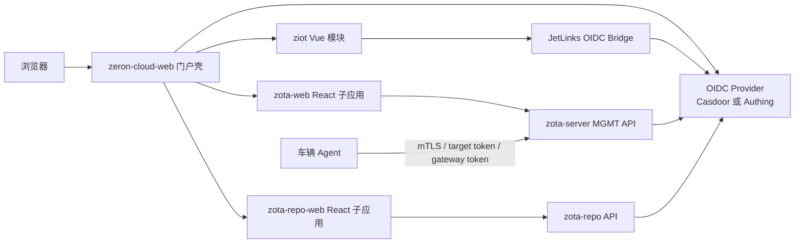

# ZOTA 统一身份与 UI 演进分析

> 分析日期：2026-08-03
> 状态：架构分析，未修改 `hawkbit`、`hawkbit-updater-ui`、`jetlinks-community`、`zeron-cloud-web` 或 zota-repo 业务代码。
> 范围：Casdoor、Authing、zota-server、zota-web、ziot、ziot-web、zota-repo 及其前端统一方案。
> 前端 UX 试点选择和实施细节见 `zota-frontend-ux-evolution.md`。

## 1. 决策摘要

1. **认证协议统一为标准 OIDC**：业务代码使用 issuer、discovery、JWKS、audience 和 claim mapping，不直接依赖 Casdoor 或 Authing SDK。Casdoor 和 Authing 是可替换的 OIDC provider profile。
2. **一个环境优先只信任一个 issuer**：Casdoor 与 Authing 都需要支持时，推荐由一个身份代理/BFF 统一入口；不建议三个业务后端各自直接接受两个 issuer 的 token。
3. **`zeron-cloud-web` 适合作为统一门户壳，不适合作为所有业务页面的唯一代码框架**：它已有用户、菜单、按钮权限和微前端承载能力，但与 JetLinks session 强耦合。
4. **`hawkbit-updater-ui` 和 `zota-repo-web` 保留 React 19 + Ant Design 6**：两者技术栈接近，适合共享 React 组件和 API/auth core，不应为了统一外观重写成 Vue。
5. **跨框架统一靠设计令牌和壳层协议**：统一颜色、密度、排版、间距、状态语义、导航、用户菜单、401/403 和主题切换；Vue 与 React 分别实现组件适配器。
6. **先统一认证，再统一壳，再逐页替换 UI**：不要同时改 IdP、权限模型、微前端和全部页面样式。

## 2. 项目实际情况

| 项目 | 技术栈 | 当前人员认证 | 当前权限 | 主要缺口 |
|---|---|---|---|---|
| ziot / `jetlinks-community` | Spring WebFlux + hsweb v5 | 本地账号、Redis session、API Key | 用户、角色、维度、菜单、API 权限完整 | 需要通用 OIDC 登录桥，不适合直接套 Spring Security Resource Server |
| ziot-web / `zeron-cloud-web` | Vue 3 + Vite 4 + Pinia + Ant Design Vue 3 + `micro-app` | `X-Access-Token` 存 localStorage | 服务端菜单、动态路由、`menuCode:buttonCode` | token 分散在 URL、下载、WebSocket、子应用；身份与 JetLinks 强耦合 |
| zota-server / `hawkbit` | Spring Boot + Spring Security | 默认静态用户 + Basic | `SpRole`、`SpPermission`、tenant、RSQL scope | OAuth2 基础已具备，需 issuer/audience/claim/permission 适配 |
| zota-web / `hawkbit-updater-ui` | React 19 + Vite 7 + Ant Design 6 + Zustand + TanStack Query | Basic 凭据保存在 localStorage | 前端只分 `Admin/Operator`，大量 `isAdmin` 判断 | 必须改为 OIDC/BFF session 和 HawkBit permissions |
| zota-repo | Go API | 已有 Casdoor SDK/JWT 模式 | 本地 `admin/developer/operator/viewer` | 与 Casdoor SDK 耦合、issuer/audience 校验和 secret 管理需加固 |
| zota-repo-web | React 19 + Vite 6 + Ant Design 6 + TanStack Query | 手写 Casdoor code exchange | 本地角色体验层判断 | SPA 中有 client secret、token 存 localStorage，需改标准 PKCE/BFF |

### 2.1 HawkBit 后端已有能力

`hawkbit-mgmt-starter` 的 `MgmtSecurityConfiguration` 已提供以下扩展点：

- `hawkbit.server.security.oauth2.resourceserver.enabled` 开启 Spring OAuth2 Resource Server。
- 有 `hawkbitOAuth2ResourceServerCustomizer` bean 时，Management API 使用 JWT；Basic 是否并存由 `allowHttpBasicOnOAuthEnabled` 控制。
- API 会话是 stateless，适合 Bearer access token。
- `OidcProperties` 支持配置 username、roles 和 tenant claim path。
- JWT converter 当前把 `roles` 当作 `Collection<String>` 并直接变成 Spring authority。
- `/rest/v1/userinfo` 会返回当前 tenant、username 和真实 authorities，前端可以直接据此构建权限。
- HawkBit 已有 `ROLE_TARGET_ADMIN`、`ROLE_REPOSITORY_ADMIN`、`ROLE_ROLLOUT_ADMIN`、`ROLE_TENANT_ADMIN` 及细粒度 `READ_*`、`CREATE_*`、`UPDATE_*`、`DELETE_*`、`HANDLE_ROLLOUT`、`APPROVE_ROLLOUT`。

因此，zota-server 不需要新增一套用户数据库。需要新增的是 provider-neutral JWT validator 和 authority mapper。

### 2.2 HawkBit 前端当前风险

- 登录页将用户名密码做 Base64 后访问 `/rest/v1/userinfo`，Zustand persist 把用户名、两级角色和 Basic token 写入 localStorage。
- Axios 始终发送 `Authorization: Basic`；401 直接清空前端状态。
- `AuthGuard` 只相信本地 `isAuthenticated`，刷新时没有先向服务端恢复真实会话。
- 前端通过 `username === 'admin'` 得出 `Admin`，大量页面以 `isAdmin` 控制按钮；这与 HawkBit 的细粒度 authority 不一致。
- SockJS/STOMP 客户端没有携带可验证的用户认证信息。启用 JWT 后，REST 成功不代表 WebSocket 自动成功。
- 当前 React 页面已有较完整的表格、详情、筛选、主题和测试基础，重写成 Vue 的收益小、回归面大。

### 2.3 `zeron-cloud-web` 作为门户壳的基础和限制

已有基础：

- 动态菜单、动态路由、用户中心、语言、主题、系统配置和按钮权限。
- `@micro-zoe/micro-app`，可通过 iframe 隔离承载不同框架子应用。
- 应用列表和菜单可把不同业务系统挂到统一导航。
- 子应用已有 `layout=false`、主题/数据传递的演进空间。

当前限制：

- 壳层认证直接依赖 JetLinks `X-Access-Token`、`/user/detail`、服务端菜单和 JetLinks WebSocket。
- 当前微前端上下文会传递原始 token；该 token 不是 HawkBit 或 zota-repo 的正确 audience，也不应跨 iframe 广播。
- Ant Design Vue 3 与 React Ant Design 6 不能共享组件实现，只能共享 token、图标规范和交互契约。
- `hawkbit-updater-ui` 目前没有 embedded 模式，会重复显示自己的 header、footer 和导航。

## 3. Casdoor 与 Authing 的统一支持方式

### 3.1 Provider-neutral 配置

所有应用使用同一配置语义，不在业务逻辑里写 `if casdoor` 或 `if authing`：

```yaml
identity:
  enabled: true
  provider: casdoor # casdoor | authing
  issuer: ${OIDC_ISSUER}
  client-id: ${OIDC_CLIENT_ID}
  client-secret: ${OIDC_CLIENT_SECRET:}
  audience: ${OIDC_AUDIENCE}
  scopes: [openid, profile, email]
  username-claim: preferred_username
  groups-claim: groups
  clock-skew-seconds: 60
```

- SPA 是 public client，只使用 client id + Authorization Code + PKCE(S256)，没有 client secret。
- JetLinks OIDC bridge/BFF 是 confidential client，secret 只在服务端 Secret 中。
- 后端从 discovery 获取 authorization、token、JWKS 和 logout metadata；厂商差异放入 provider adapter。
- `sub` 是跨系统稳定身份；username/email 只用于展示和首次建档。

### 3.2 单 issuer 与双 provider

推荐顺序：

1. **单 provider 可切换**：每个环境选择 Casdoor 或 Authing，代码不变，只切配置。这是第一阶段目标。
2. **单 issuer 身份代理**：若需要同时显示“Casdoor 登录”和“Authing 登录”，由 Casdoor、Authing 或独立 BFF 作为统一 broker，对业务系统只签发一个规范 token。
3. **多 issuer 资源服务器**：仅在无法使用 broker 时采用。HawkBit 需要 `AuthenticationManagerResolver`，Go 和 hsweb 也需按未验证 token 的 issuer 选择可信配置，再分别校验 audience 和签名；运维和测试成本最高。

不要让同一 API 无条件接受任意 discovery URL，也不要按请求参数动态信任 issuer。

### 3.3 统一 claim 合约

业务后端统一接收规范化后的字段：

| 字段 | 规则 |
|---|---|
| `iss` | 精确匹配环境 allow-list |
| `aud` | 精确匹配当前资源服务器，不能只匹配 SPA client id |
| `sub` | 必须非空，作为用户绑定主键 |
| `exp/nbf/iat` | 校验并限制 clock skew |
| `preferred_username/name/email` | 展示和建档，不作为唯一主键 |
| `groups/roles` | 先归一化，再按应用 allow-list 映射 |
| `tenant` | HawkBit 第一阶段固定 `DEFAULT` |

Casdoor role object、Casdoor/Authing 的字符串 groups 和自定义 namespace claim 都由 adapter 变成 `Set<String>`。业务权限只能由映射表产生，未知 group 默认不授权。

## 4. 推荐目标架构



短期每个子应用自行完成 OIDC code flow，但利用 IdP session 实现无感 SSO。长期若要求 token 不进入浏览器、跨 audience 调用和统一退出，增加同源 `zota-auth-bff`：浏览器只持有 HttpOnly cookie，BFF 在服务端保存 provider token 并代理三套 API。

## 5. zota-server / zota-web 实施步骤

### Phase H0：安全和契约

- 轮换当前源码/配置中已经出现的数据库、消息队列、对象存储、静态管理员和 OAuth secret；文档、示例和生产 Secret 分离。
- 创建独立 OIDC application/audience：zota-server Management API 与 zota-web browser client 不混用 secret。
- 固定 `DEFAULT` tenant，定义 group 到 HawkBit authority 的 allow-list。
- 准备 staging 回调、CORS、logout 和 JWKS 轮换配置。

### Phase H1：HawkBit Resource Server

1. 启用 `hawkbit.server.security.oauth2.resourceserver.enabled`，配置 issuer/JWKS。
2. 增加 audience validator；不能只依赖 Spring 默认 issuer 和时间校验。
3. 替换默认 roles converter：兼容字符串、数组和对象，拒绝未知类型。
4. 将规范 group 映射到最终 HawkBit authorities，例如：
   - `zota-ota-admin` -> `ROLE_TENANT_ADMIN`
   - `zota-release-manager` -> `ROLE_REPOSITORY_ADMIN` + `ROLE_ROLLOUT_ADMIN`
   - `zota-operator` -> 明确的 read/update/handle permissions
   - `zota-viewer` -> 只读 permissions
5. `/rest/v1/userinfo` 继续返回最终 permissions，必要时增加稳定 `subject` 和 display name，但不暴露原始 token。
6. staging 暂时允许 Basic fallback；JWT 验收完成后将 `allowHttpBasicOnOAuthEnabled` 设为 false。
7. 为 issuer、audience、claim 类型、角色映射、tenant、401 和 403 增加安全测试。

### Phase H2：zota-web 认证和权限

1. 把 `useAuthStore` 改为 `NormalizedUser + permissions + sessionStatus`，删除 Basic token 和 `Admin/Operator` 两级模型。
2. 登录页只负责跳转 OIDC；回调页处理 state/nonce/PKCE。采用 BFF 时回调由服务端完成。
3. 启动时调用 `/rest/v1/userinfo` 恢复会话，不能只信任 localStorage 的 boolean。
4. Axios 从 auth session 获取 Bearer token，或仅发送同源 cookie；401 重新认证，403 显示无权限，网络失败保持会话。
5. 提供 `can('CREATE_TARGET')`、`canAll([...])`、`canAny([...])`，逐步替换全部 `isAdmin`。
6. 路由、菜单、按钮、批量操作和危险操作按实际 `SpPermission` 声明权限。
7. SockJS/STOMP 选择同源 HttpOnly cookie，或 STOMP `CONNECT` 短期 token + 服务端 channel interceptor；在完成前保留 polling fallback。
8. 增加 embedded 模式：由壳层承载 header/sidebar 时隐藏 zota-web 自己的 header/footer，保留 standalone 模式便于回滚。

### Phase H3：生产切换

- Casdoor/Authing 成为人员登录主入口，Basic 只作为网络隔离、审计完备的 break-glass 通道。
- DDI、artifact target download、gateway token 和车辆 mTLS 不改。
- 演练 IdP 故障、JWKS 缓存、密钥轮换、权限收回、logout 和回滚。

## 6. 是否以 `zeron-cloud-web` 为主框架

### 6.1 推荐答案

**建议把 `zeron-cloud-web` 演进为统一门户主壳，但不建议把所有 UI 重写为 `zeron-cloud-web` 的 Vue 页面。**

“主框架”分为两层：

- 门户主框架：`zeron-cloud-web`，负责统一登录、全局导航、应用菜单、用户菜单、语言、主题、全局通知和微前端生命周期。
- 业务开发框架：ziot 继续 Vue；zota-web 和 zota-repo-web 继续 React。业务页面保留独立部署、路由和 API ownership。

这比选择 Vue 或 React 全量重写更可控，也允许先接入、后替换。

### 6.2 为什么不直接统一成 React 或 Vue

| 方案 | 收益 | 代价 | 结论 |
|---|---|---|---|
| 全部重写为 Vue | 与 ziot 壳一致 | HawkBit/zota-repo 大量成熟 React 页面重写，测试和业务回归巨大 | 不推荐 |
| 全部重写为 React | React 两套 UI 技术更新、组件可共享 | JetLinks 用户、菜单、按钮、管理模块和微前端壳重写 | 不推荐 |
| Vue 壳 + React/Vue 子应用 | 利用现有能力，渐进迁移，独立回滚 | 需要统一 auth、token、theme 和嵌入协议 | 推荐 |
| 仅 iframe 拼接 | 上线最快 | 双导航、主题不一致、token 泄漏和体验割裂 | 仅作过渡 |

## 7. 统一 UI 的实现方式

### 7.1 建立跨框架设计令牌

新增独立版本化包或静态产物：

```text
packages/zeron-design-tokens/
  tokens.json
  css/variables.css
  react/antdTheme.ts
  vue/antdTheme.ts
```

统一内容包括：

- 品牌色和语义色：success、warning、danger、info、设备/发布/回滚状态。
- 字体、字号、行高、间距、阴影、层级、动效和断点。
- 表格密度、表单宽度、页头、工具栏、筛选器、弹窗、抽屉、空态和错误态。
- radius 以 4/6/8px 为主；减少大圆角卡片、玻璃背景、装饰渐变和漂浮阴影。
- 运营工具优先信息密度、扫描和批量操作，不追求营销页式视觉。

Vue/React 使用各自组件库，但映射同一 token。React 两个应用再共享 `@zeron/react-ui` 的 PageHeader、DataTable、PermissionButton、StatusTag、ErrorState 等组件。

### 7.2 壳层协议

壳层只向子应用传递非敏感上下文：

```ts
type PortalContext = {
  locale: 'zh-CN' | 'en-US'
  theme: 'light' | 'dark'
  density: 'compact' | 'comfortable'
  user: { id: string; displayName: string; avatar?: string }
  navigate(path: string): void
}
```

禁止通过 `micro-app data`、postMessage 或 URL 传长期 access token。子应用通过同源 BFF cookie，或自行执行对应 audience 的 OIDC session 恢复。

### 7.3 页面替换顺序

1. 统一登录、回调、会话过期、无权限、服务不可用页面。
2. 统一 portal header、sidebar、breadcrumb、用户菜单、主题和语言。
3. zota-web 增加 embedded 模式，去除双 header/footer。
4. 统一列表页：PageHeader、FilterBar、DataTable、批量操作和分页。
5. 统一详情页、表单、弹窗、状态标签、审计信息和危险操作确认。
6. 最后调整 Dashboard；仪表盘最容易产生风格分叉，不应作为第一批重构目标。

每一批都保留 standalone 路由和 feature flag，可按应用回滚。

## 8. 跨仓库分支和 PR 顺序

这些目录是独立 Git 仓库，必须分别建分支：

| 仓库 | 建议分支 |
|---|---|
| `.github` | `docs/zota-unified-identity-ui` |
| `hawkbit` | `feat/zota-oidc-resource-server` |
| `hawkbit-updater-ui` | `feat/zota-oidc-permissions` |
| `jetlinks-community` | `feat/ziot-generic-oidc-bridge` |
| `zeron-cloud-web` | `feat/zeron-portal-shell` |
| `zota-repo` | `feat/generic-oidc-verifier` |
| `zota-repo-web` | `feat/oidc-pkce-session` |
| IdP/IaC 仓库 | `chore/zota-identity-providers` |

当前多个仓库已有未提交配置或 lockfile 修改，创建/切换分支前必须先确认这些改动的归属，不得覆盖。

推荐 PR 依赖顺序：

1. 身份 claim/audience/permission 契约和设计 token。
2. HawkBit Resource Server + 测试。
3. zota-web OIDC、permissions 和 embedded 模式。
4. JetLinks generic OIDC bridge + zeron portal session。
5. zota-repo generic OIDC + 前端 PKCE/BFF。
6. 门户聚合、统一主题和逐页 UI 替换。

## 9. 验收和回滚

关键验收：

- Casdoor profile 和 Authing profile 分别可在 staging 登录，切换只改配置。
- 三个业务后端都拒绝错误 issuer/audience、过期 token 和未知角色。
- zota-web 前端按钮权限与 `/rest/v1/userinfo.permissions` 一致，不能再由用户名推断管理员。
- 用户通过门户进入三个子应用不重复输入密码，且 token 不出现在 URL、日志、localStorage 或微前端消息中。
- zota-web standalone 和 embedded 模式均可用，主题、语言、路由和退出行为一致。
- WebSocket、文件上传下载、跨标签页退出和 IdP 密钥轮换完整验证。
- 车辆 DDI、API Key、服务 token 和自动化部署链不受人员 SSO 影响。

回滚依赖 `local|oidc|hybrid` 登录模式、Basic break-glass、子应用 standalone 路由和 UI feature flag。回滚认证时不能删除本地用户、角色、第三方绑定或权限数据。

## 10. 最终建议

当前最佳路线不是选择一个前端框架重写所有系统，而是：

1. 用 provider-neutral OIDC 同时兼容 Casdoor 和 Authing。
2. 先把 HawkBit 的 JWT authority 与前端 permission 做正确。
3. 将 `zeron-cloud-web` 收敛为统一门户壳，去除对单一 JetLinks token 的全局假设。
4. 用微前端承载现有 React 应用，以设计令牌和 embedded 模式统一体验。
5. 页面按工作流逐步替换，认证、权限和 UI 不在同一个发布窗口全部重做。
