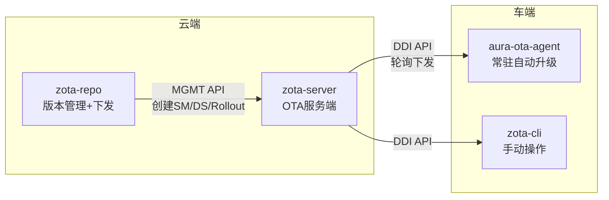

# ZOTA 平台 — 功能说明与架构指南

导航表格

| 角色 | 核心章节 | 目的 |
|------|----------|------|
| 项目管理 | 一、二、四 | 了解平台能力和发布方式 |
| 产品 | 一、二、四、八 | 了解整体流程和用户体验 |
| 研发 | 二、三、八、九 | 了解架构和车端机制 |
| 发布工程师 | 四、五、六、七 | 掌握日常发布操作 |
| 运维 | 九、十、十一 | 掌握回滚和排障 |

更新日期：2026-08-03

## 一、平台概览

ZOTA 是整车 OTA 平台，由四个核心组件协同工作：

| 组件 | 位置 | 一句话 |
|------|------|--------|
| zota-repo | 云端 K8s | 软件版本全生命周期管理 + 一键下发 |
| zota-server | 云端 K8s | OTA 服务端，管理车辆、分发更新 |
| aura-ota-agent | 车端常驻 | 后台轮询 zota-server，自动下载安装更新 |
| zota-cli | 车端按需 | 命令行工具，手动升级/回滚/诊断 |



## 二、架构设计

### 2.1 设计原则

| 原则 | 说明 |
|------|------|
| zota-server 是唯一 OTA 入口 | 车端只和 zota-server 通信（DDI 协议），不直连 zota-repo |
| zota-repo 可写 zota-server | repo 通过 MGMT API 创建模块/分发/灰度，但车端无感知 |
| 按类型分发，不按名称 | 车端 agent 根据 Part 类型（docker/archive）选择 handler，模块名仅用于标识 |
| 签名不可跳过 | 生产环境所有更新包必须验签（docker: cosign，archive: SHA256） |
| Pre-flight 前置检查 | 升级前检查磁盘/电池/车辆状态/并发锁，任一不满足则拒绝 |
| 失败自动回滚 | 健康检查 3 次失败 → 自动切回旧版本；archive 保留最近 3 个备份 |

### 2.2 组件交互

```
┌─ 云端 ──────────────────────────────────────────────────┐
│                                                          │
│  zota-repo                     zota-server               │
│  ┌──────────────┐  MGMT API   ┌──────────────────────┐  │
│  │ Catalog      │──→ SM/DS ──→│ SoftwareModule       │  │
│  │ ReleaseBundle│──→ Rollout →│ DistributionSet      │  │
│  │ Deploy       │             │ Rollout (RSQL filter) │  │
│  │ DeployHistory│←── 结果 ───│ Target Attributes    │  │
│  └──────────────┘             └──────────┬───────────┘  │
│                                          │ DDI API       │
└──────────────────────────────────────────┼───────────────┘
                                           │
┌─ 车端 ───────────────────────────────────┼───────────────┐
│                                          ▼               │
│  aura-ota-agent (常驻)           zota-cli (按需)         │
│  ┌──────────────────┐          ┌──────────────────┐     │
│  │ 30s 轮询 DDI     │          │ update/rollback   │     │
│  │ detectMode(Part) │          │ archive list      │     │
│  │ → docker handler │          │ doctor/diagnose   │     │
│  │ → archive handler│          │ pause/resume      │     │
│  └──────────────────┘          └──────────────────┘     │
│                                                          │
│  ┌─────────┐  ┌──────────┐  ┌────────────────────┐     │
│  │ Docker   │  │ archive  │  │ .zota/backups/     │     │
│  │ pull+switch│ │ 解压到   │  │ {module}/0,1,2/   │     │
│  │          │  │ target_dir│ │ 自动版本备份       │     │
│  └─────────┘  └──────────┘  └────────────────────┘     │
└──────────────────────────────────────────────────────────┘
```

### 2.3 设备同步（ziot → zota-repo + zota-server）

车辆在 IoT 平台（ziot）注册后，自动同步到 ZOTA：

```
ziot 设备注册
  │  DeviceInstance { VIN, productId }
  │
  ├─→ syncToZotaRepo()
  │     POST /api/v1/inventory/vehicles
  │     → zota-repo 库存表 zota_vehicle_inventory
  │
  └─→ syncToZotaServer()
        PUT /rest/v1/targets/{vin}/attributes
        → zota-server target 属性（productId, internalCode）
```

同步后，zota-repo 知道「有哪些车，属于哪个产品」，zota-server 知道「这个 VIN 的属性是什么」。Rollout 下发时通过 `productId` 匹配目标车辆。

### 2.4 车端通讯（DDI 协议）

车端与 zota-server 的唯一通讯协议是 DDI（Direct Device Integration）：

| 环节 | 接口 | 说明 |
|------|------|------|
| 轮询 | `GET /{tenant}/controller/v1/{VIN}` | agent 每 30s 查询是否有新 action |
| 下载 | `GET /{tenant}/controller/v1/{VIN}/softwaremodules/{smID}/artifacts/{hash}` | 下载更新包 |
| 反馈 | `POST /{tenant}/controller/v1/{VIN}/deploymentBase/{actionID}/feedback` | 上报执行状态（成功/失败/进度） |
| 属性上报 | `PUT /{tenant}/controller/v1/{VIN}/configData` | 上报标定版本、车辆状态 |

认证方式：mTLS（设备证书）+ Target Security Token 双重认证。

### 2.5 部署架构

```
┌─ K8s 集群 ──────────────────────────────────────────────────────────┐
│                                                                     │
│  ┌──────────────┐  ┌──────────────┐  ┌──────────────┐               │
│  │ zota-repo-web│  │  zota-web    │  │  ArgoCD      │               │
│  │ React SPA    │  │  React SPA   │  │  GitOps 同步  │               │
│  │ (Nginx)      │  │  (Nginx)     │  │              │               │
│  └──────┬───────┘  └──────┬───────┘  └──────────────┘               │
│         │                 │                                         │
│  ┌──────▼───────┐  ┌──────▼───────┐  ┌──────────────┐               │
│  │  zota-repo   │  │ zota-server  │  │    Vault     │               │
│  │  Go / Chi    │  │   Java       │  │  PKI (mTLS)  │               │
│  │  :8080       │──│ :8090 MGMT   │  │              │               │
│  └──────┬───────┘  └──┬───┬───┬──┘  └──────────────┘                │
│         │             │   │   │                                     │
│  ┌──────▼───────┐     │   │   └──────────────┐                      │
│  │  PostgreSQL  │◄────┘   │                  │                      │
│  │  (主数据库)   │         │          ┌──────▼───────┐               │
│  └──────────────┘    ┌────▼───────┐  │  Prometheus  │               │
│                      │ RabbitMQ   │  │  + Grafana   │               │
│  ┌──────────────┐    │ (事件队列)  │  │  监控告警     │               │
│  │  TOS 对象存储  │    └────────────┘  └──────────────┘              │
│  │  artifacts/  │                                                   │
│  └──────────────┘                                                   │
│                                                                      │
│  K8s 保障: HPA 自动扩缩 | startupProbe | livenessProbe | readinessProbe │
└──────────────────────────────────────────────────────────────────────┘

┌─ 车端 ──────────────────────────────────────────────────────────────┐
│                                                                      │
│  ┌─────────────────────┐    ┌─────────────────────┐                 │
│  │ aura-ota-agent      │    │ zota-cli             │                 │
│  │ systemd 常驻服务     │    │ 手动 CLI 工具         │                 │
│  │ DDI 轮询 → 自动升级  │    │ update/rollback/doctor│                │
│  └─────────────────────┘    └─────────────────────┘                 │
│                                                                      │
└──────────────────────────────────────────────────────────────────────┘
```

| 组件 | 类型 | 说明 |
|------|------|------|
| zota-repo | Go 服务 | 版本管理 + 下发，端口 8080 |
| zota-repo-web | React SPA | 版本管理前端，Nginx 静态服务 |
| zota-server | Java 服务 | OTA 引擎，DDI :8090 / MGMT :8090 |
| zota-web | React SPA | OTA 管理前端 |
| PostgreSQL | 数据库 | zota-repo + zota-server 共享（不同库） |
| RabbitMQ | 消息队列 | zota-server 事件总线（DDI 通知等） |
| TOS | 对象存储 | 软件包 artifact 存储（火山引擎） |
| Vault | PKI | 车端 mTLS 证书签发与续期 |
| ArgoCD | GitOps | K8s 资源同步部署 |
| Prometheus+Grafana | 监控 | 服务指标 + 告警 |

### 2.6 安全与可用性

安全：

| 层面 | 措施 |
|------|------|
| 车端通讯 | mTLS 双向认证 + Target Security Token |
| 证书管理 | Vault PKI 签发，自动续期，吊销列表 |
| 更新包 | Docker: Cosign 签名验证 / Archive: SHA256 校验 |
| K8s 网络 | NetworkPolicy 限制 Pod 间通信 |
| 访问控制 | zota-server MGMT API Basic Auth，zota-repo 接入 Casdoor OAuth2（规划中） |

可用性：

| 层面 | 措施 |
|------|------|
| 多副本 | zota-server 3 副本，zota-repo 2 副本 |
| 自动扩缩 | HPA（Horizontal Pod Autoscaler），基于 CPU/Memory |
| 健康检查 | startupProbe（启动保护）+ livenessProbe（自动重启）+ readinessProbe（流量摘除） |
| 数据库 | PostgreSQL 主从复制 |
| 部署 | ArgoCD GitOps，配置变更自动同步，回滚一键完成 |
| 监控告警 | Prometheus 采集指标，Grafana 8 面板 + 告警规则 |

## 三、核心概念

### 3.1 版本生命周期

每个模块版本在 Catalog 中有四个阶段：

```
dev → staging → validation → production
 │        │           │            │
 开发中    提测        验证通过      可发布
```

| 阶段 | 含义 | 能否下发 |
|------|------|:--:|
| `dev` | 开发中，不稳定 | ❌ |
| `staging` | 已提测，等待验证 | ❌ |
| `validation` | 验证通过，待审批 | ❌ |
| `production` | 已发布，可部署 | ✅ |

只有 `production` 状态的版本才能加入 ReleaseBundle 并下发给车辆。

### 3.2 模块类型（Part）

车端 agent 根据 Part 类型（而非模块名称）决定如何处理更新：

| Part | 说明 | 车端行为 |
|------|------|----------|
| `docker` | 容器镜像 | `docker pull` → 停旧容器 → 启新容器 → 健康检查 |
| `archive` | 文件包（.zip/.tar.gz） | 下载 → 解压到目标目录 → 可选重启容器 |

### 3.3 模块类型对齐（三端一致）

| 模块 | Catalog Type | Bundle Part | Manifest Part | Agent Handler | 默认 target_dir |
|------|-------------|:--:|:--:|:--:|------|
| aura | container | docker | docker | ModeDocker | — |
| systemd_service | systemd_service | archive | archive | ModeArchive | /home/nvidia/zeron/manifest/systemd_service |
| calibration | calibration | archive | archive | ModeArchive | /home/nvidia/zeron/manifest/calibration |
| config | config | archive | archive | ModeArchive | /home/nvidia/zeron/manifest/config |
| models | archive | archive | archive | ModeArchive | /home/nvidia/zeron/manifest/models |

manifest.yml 中的 metadata.target_dir 优先级高于默认值；若两者都为空，报错。

### 3.4 新增模块

新增一个模块类型时，需要同步修改以下四处：

| 步骤 | 位置 | 修改内容 |
|:--:|------|------|
| 1 | `zota-repo/internal/deploy/handler.go` | `catalogTypeToPart` 添加类型→Part 映射 |
| 2 | 同上 `writeModuleMetadata` | switch case 添加新类型（设置 target_dir） |
| 3 | `aura-ota-agent/internal/updater/handler.go` | 若为新 Part，`detectMode` 添加 case |
| 4 | 本文档 3.3 对齐矩阵 | 添加新行 |

示例：新增 `ros2_pkg` 模块（archive 类）

1. `catalogTypeToPart` 加：`"ros2_pkg": "archive"`
2. `writeModuleMetadata` 加：`case "ros2_pkg":` 设置 target_dir
3. 若 Part 是 archive，`detectMode` 无需修改
4. 对齐矩阵加一行：`ros2_pkg | ros2_pkg | archive | archive | ModeArchive | ...`

新增 Part（如 `rauc`）则需要同时在 agent `detectMode` 添加新 case 和处理函数。

### 3.5 下发链路

```
zota-repo                    zota-server                  车端
   │                             │                          │
   ├─ GetOrCreateSM ────────────→│                          │
   ├─ UploadArtifact ───────────→│                          │
   ├─ CreateDS ─────────────────→│                          │
   ├─ CreateRollout ────────────→│                          │
   │                             ├─ 匹配车辆 ──────────────→│
   │                             │        DDI轮询 ←─────────┤
   │                             ├─ 下发action ────────────→│
   │                             │        下载+安装         │
   │                             │        Feedback ←───────┤
```

## 四、两种发布方式

### 4.1 对比

| 发布方式 | Bundle 发布 | Manifest 发布 |
|---|---|---|
| 输入 | 选 ReleaseBundle + 产品 | 手写 manifest.yml |
| 版本来源 | Catalog 中 production 版本 | 自由指定任意版本 |
| 适用场景 | 日常发布、批量升级 | 定制组合、紧急修复 |
| 推荐度 | ⭐⭐⭐ 日常首选 | ⭐⭐ 特殊场景 |

### 4.2 如何选择

- 日常发布 → Bundle：在 Catalog 里维护好各模块的 production 版本，一键下发
- 临时组合 → Manifest：需要特定模块版本混搭时使用

## 五、Bundle 发布流程（推荐日常使用）

### Step 1：确保模块版本已发布到 Catalog

在 zota-repo Web UI 的 Catalog 页面，确认各模块已有 `production` 状态的版本。

### Step 2：创建 ReleaseBundle

在 zota-repo Web UI → Release Bundles → 新建，选择需要发布的模块版本组合。

### Step 3：一键下发

```bash
curl -X POST https://zota-repo.intra.zeron.ai/api/v1/deploy \
  -H 'Content-Type: application/json' \
  -d '{
    "release_bundle_id": 42,
    "product_id": "K_DC_L2",
    "auto_start": true
  }'
```

发生了什么（6 步全自动）：

| 步骤 | 操作 | 说明 |
|:--:|------|------|
| 1 | `GetOrCreateSoftwareModule` | 为每个模块在 zota-server 创建 SM（幂等） |
| 2 | `UploadArtifact` | 上传模块文件到 zota-server |
| 3 | `CreateDistributionSet` | 创建 DS `DB-{product}-{timestamp}` |
| 4 | `AssignModulesToDS` | 关联所有 SM |
| 5 | `CreateRollout` | 创建 Rollout，通过 `productId` 匹配目标车辆 |
| 6 | `StartRollout` | 自动启动下发（`auto_start: true`） |

### Step 4：观察结果

- zota-repo → Deploy History 查看下发状态
- zota-web → Rollouts 查看分发进度
- 车端 agent 自动轮询并升级

## 六、Manifest 发布流程（特殊场景）

### Step 1：编写 manifest.yml

```yaml
version: "0.0.1"
modules:
  - part: docker
    name: aura
    version: "1.0.2"
    enabled: true
    metadata:
      container: "zeron"
      restart_container: "false"
    artifacts:
      - download: "harbor.intra.zeron.ai/smartdrive/aura_data_collection_aarch64:v1.0.2"
  - part: archive
    name: systemd_service
    version: "0.0.1"
    enabled: true
    metadata:
      target_dir: "/home/nvidia/zeron/manifest/systemd_service/"
      restart_container: "false"
```

### Step 2：通过 API 下发

```bash
curl -X POST https://zota-repo.intra.zeron.ai/api/v1/deploy/manifest \
  -H 'Content-Type: application/json' \
  -d '{
    "manifest_yaml": "<上面的 YAML 内容>",
    "product_id": "K_DC_L2",
    "auto_start": true
  }'
```

zota-repo 会将 manifest 中的每个 module 拆成独立的 SoftwareModule，其余流程与 Bundle 一致。

## 七、标定下发（per-VIN）

标定（calibration）不按产品批量，而是绑定到单台车。

### Step 1：上传标定文件

在 zota-repo Web UI → Calibrations，上传标定文件并绑定到 VIN。

### Step 2：打包

```bash
curl -X POST https://zota-repo.intra.zeron.ai/api/v1/calibrations/package \
  -H 'Content-Type: application/json' \
  -d '{"vin":"LS6N3EV00PF000001", "module_name":"calibration"}'
```

### Step 3：下发

```bash
curl -X POST https://zota-repo.intra.zeron.ai/api/v1/deploy/calibration \
  -H 'Content-Type: application/json' \
  -d '{"vin":"LS6N3EV00PF000001"}'
```

与 Bundle/Manifest 不同，标定下发走 AssignDistributionSet 直配单台 VIN，不创建 Rollout（单台没必要）。

## 八、车端升级过程

### 8.1 自动升级（aura-ota-agent）

agent 常驻后台，默认每 30 秒轮询一次 zota-server：

```
轮询 → 发现新 action → Pre-flight检查 → 下载 → 安装 → 健康检查 → Feedback
```

Pre-flight 检查（任一不满足则拒绝）：
- 磁盘空间 ≥ 要求
- 车辆未在行驶中
- 电池电量 ≥ 阈值
- 无其他更新进行中（互斥锁）

### 8.2 手动升级（zota-cli）

与云端下发走同一条 DDI 通道，区别是车端主动触发而非等待 agent 轮询：

```bash
# 单模块单次升级（从 zota-server 拉取最新 action）
zota-cli update --config calibration

# 多模块批量升级
zota-cli update --config calibration,planning

# 查看所有模块当前版本
zota-cli status --all
```

## 九、回滚机制

### 9.1 自动回滚（agent 内置）

| 场景 | 触发条件 | 行为 |
|------|----------|------|
| 健康检查失败 | 容器启动后 3 次健康检查不通过 | 自动切回旧容器 |
| Docker 容器 | 新容器异常退出 | SafeSwitch 原子切回 |

### 9.2 手动回滚（zota-cli）

```bash
# 回滚 Docker 容器到上一版本
zota-cli rollback

# 查看 archive 备份列表
zota-cli archive list

# 回滚 archive 到指定版本
zota-cli archive rollback --module calibration --version 3
```

### 9.3 Archive 版本备份

archive 类型模块在更新前会自动备份到 `.zota/backups/{module}/`，保留最近 3 个版本：

```
/home/nvidia/zeron/
├── manifest/                     ← Docker mount（干净，只有当前版本）
│   ├── systemd_service/
│   ├── models/
│   └── calibration/
│
└── .zota/                        ← Agent 管理（不 mount，隐藏目录）
    ├── backups/
    │   ├── systemd_service/
    │   │   ├── 0/                ← 最近一次备份
    │   │   ├── 1/                ← 上上次
    │   │   └── 2/                ← 上上上次
    │   └── models/
    │       ├── 0/
    │       └── 1/
    └── versions/
        ├── systemd_service.json  ← {"version":"1.0.3","action_id":"..."}
        └── models.json
```

### 9.4 暂停/恢复

```bash
zota-cli pause      # 暂停 agent 轮询，停止接收新更新
zota-cli resume     # 恢复轮询
```

## 十、操作速查

```bash
# ═══ 云端：zota-repo ═══

# Bundle 下发
curl -X POST .../api/v1/deploy \
  -d '{"release_bundle_id":42, "product_id":"K_DC_L2", "auto_start":true}'

# Manifest 下发
curl -X POST .../api/v1/deploy/manifest \
  -d '{"manifest_yaml":"...", "product_id":"K_DC_L2", "auto_start":true}'

# 标定下发（单台 VIN）
curl -X POST .../api/v1/deploy/calibration \
  -d '{"vin":"LS6N3EV00PF000001"}'

# 查看下发历史
curl .../api/v1/deploy/history

# ═══ 车端：zota-cli ═══

zota-cli status --all           # 所有模块状态
zota-cli update --config cam    # 手动升级
zota-cli rollback               # 回滚
zota-cli pause / resume         # 暂停/恢复
zota-cli doctor                 # 全量诊断
zota-cli archive list           # 查看备份
zota-cli archive rollback --module xxx --version N
```

## 十一、常见问题

Q: Bundle 和 Manifest 能混用吗？
A: 可以，两者最终都在 zota-server 中创建独立的 DS 和 Rollout，互不影响。

Q: 下发后多久车端会升级？
A: 取决于 agent 轮询间隔（默认 30s）+ 下载时间 + 安装时间。通常 1-5 分钟。

Q: 如何确认升级成功？
A: zota-repo → Deploy History 查看每条记录的状态；zota-web → Targets 查看车辆实际版本。

Q: 回滚后还能再升回去吗？
A: 可以，重新下发目标版本即可。archive 的旧备份不会被删除。

